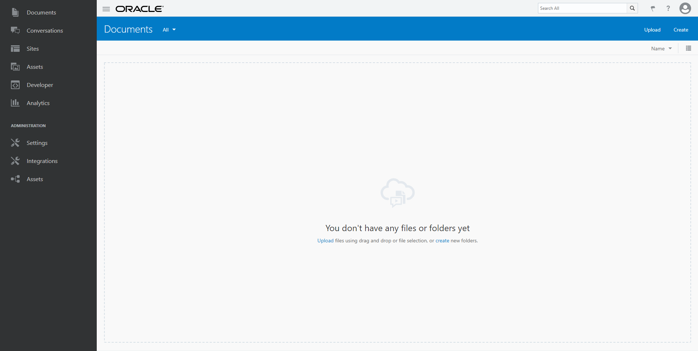

# QuickStart for Oracle Content and Experience (OCE)

## Create Autonomous CECS Instance
This is a step-by-step guide with screenshot on how to create an autonomous CECS instance.
At the moment this page is created, autonomous CECS is at the version 18.4.1.1810080425.
If a documentation is required to be reference, please have a look at the following link:
https://docs.oracle.com/en/cloud/paas/content-cloud/administer/create-autonomous-cec-instance-universal-credits.html
The link can be found under Administering Oracle Content and Experience Cloud chapter 2 in sub-chapter Create an Autonomous Content Instance with a Universal Credits Subscription.

## Step-by-step guide

1. Access your Oracle cloud environment by providing the **Identity Domain** name then followed with the username and password of the account used for the first time account registration.

2. Once the login is successful, you will be seeing the dashboard. Click the **menu button** on the top left corner.
Once the User Management page appears, click the **Identity Console** button on the top right corner to go to the Users page.

3. Once in the Identity Console page, the menu on the top left corner will now show the Groups menu. From there, we can make sure that the user we are currently using is part of the OCI_Administrators group and also creating some other groups which will be used later for the ease of use of granting access and permission to the CECS users.
As seen on the screenshots, CECS SSEK Enterprise User and CECS SSEK Standard User groups have been created.

4. Click the OCI_Administrators to make sure that the user we are using right now is part of the OCI_Administrators.
As seen on the left side, my account has already become part of the OCI_Administrators group.

5. Now let's open a new window and navigate to https://console.us-ashburn-1.oraclecloud.com/ to create the new user to managed the OCI storage which will be used by the autonomous CECS.

6. If you wish to create a new user to be used by the autonomous CECS creation phase, please follow this step.
If this is the first time we access the OCI environment, we may need to create a new user. 

7. The screenshot showed information about my account. The important things we need to do here are:

+ 1. Take note on the **OCID**, which can be found under the User Information box
+ 2. Create the private and public keys for the API key. Please refer to the Create API Keys for the autonomous CECS article for step-by-step guide.
+ 3. Add the public key to the API Key of the user then copy the Fingerprint result into notepad.
+ 4. Add the user account to be part of the Administrators group.

8. The screenshots show the compartment creation.
Once the compartment is created, please take note on the OCID as that will be used during autonomous CECS instance creation.

9. The screenshots show how to get the Tenancy OCID which will be used during the autonomous CECS instance creation as well.

10. The screenshots shows the steps to begin the autonomous CECS instance creation.

The information below please check also - [Creating API Keys for OCE provisioning](001/README.md)

11. The screenshot shows the confirmation page before we begin the instance creation.

12. The screenshot shows that during instance creation, the status will show Creating instance.

13. The screenshots showed that once the instance creation is finished, you would see the Tags and you will get an email notification as well.

14. The screenshots showed how to access the CECS instance and how it looked when you're in the instance.

