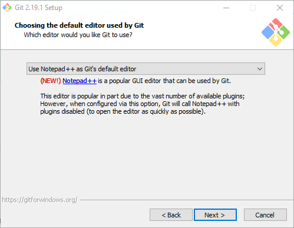
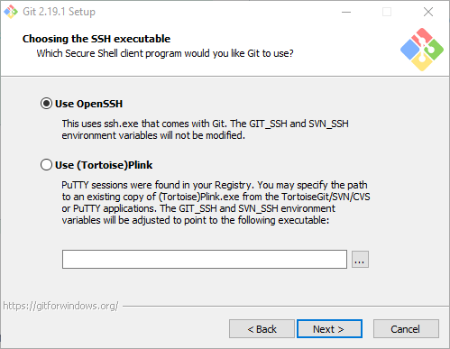
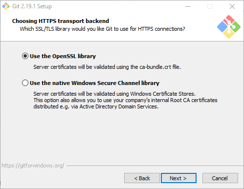
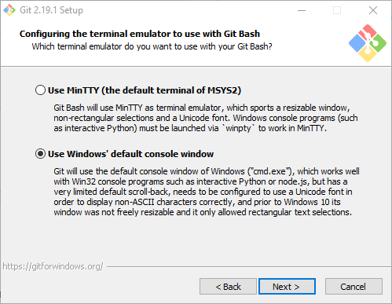
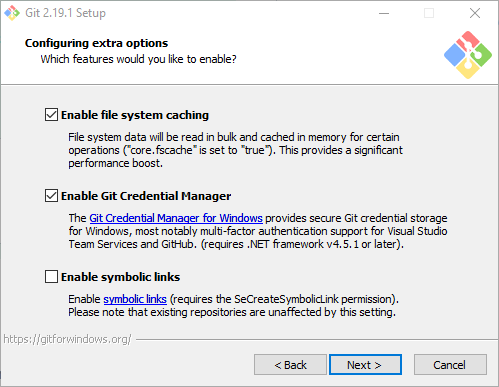
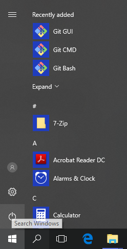
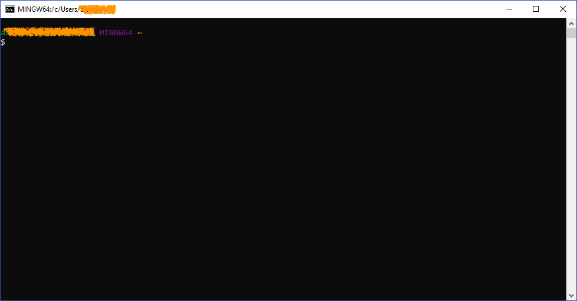
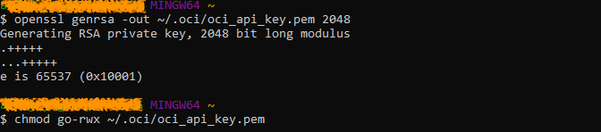
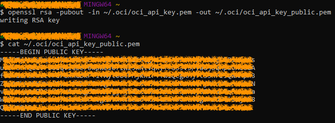

# QuickStart for Oracle Content and Experience (OCE)

## Create API Keys for autonomous CECS
There's a step in the creation of autonomous CECS instance where we need to provide the private key and public key finger print in the creation phase.
The steps below will guide you to create the API keys.

To create the API keys on Windows environment, we need to have git-bash installed.
The git-bash for windows installer can be downloaded here: https://git-scm.com/download/win
Important steps while installing git-bash for Windows are shown below. The rest of the dialog box would just clicking the Next button

1. When you need to choose the editor used by Git, choose Notepad++ because it is the closes to Windows notepad and easy to use

2. When you get to Adjusting your PATH environment, choose the second option.

3. When you get to the Choosing the SSH executable, choose the first option

4. When you get to the Choosing HTTPS transport backend, choose the first option.

5. When you get to the Configuring the line ending conversions, choose the first option.

6. When you get to the Configuring the terminal emulator to use with Git Bash, choose the second option

7. When you get to the Configuring extra options, un-tick the Enable symbolic links.

## Step-by-step guide

1. When the Git Bash installation is completed, you should be able to see the Git Bash in the Windows start menu.

2. When Git Bash is launch, the window would look like that. The following steps are happening inside the Git Bash command line interface.
Any file created there would be stored under **C:\Users\<username>** directory.

3. Follow the steps on shown below

Generate a Private Key 
``
mkdir ~/.oci
openssl genrsa -out ~/.oci/oci_api_key.pem 2048
chmod go-rwx ~/.oci/oci_api_key.pem
``

### Generate a Public Key

``
openssl rsa -pubout -in ~/.oci/oci_api_key.pem -out ~/.oci/oci_api_key_public.pem
cat ~/.oci/oci_api_key_public.pem
``
