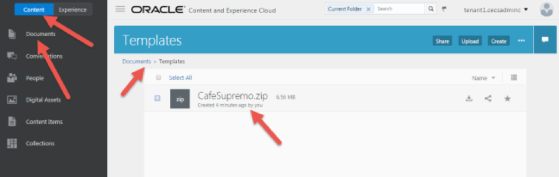
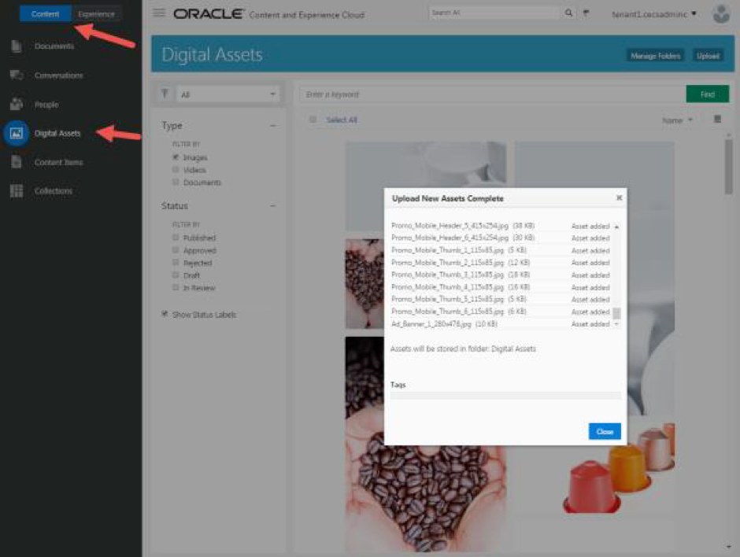
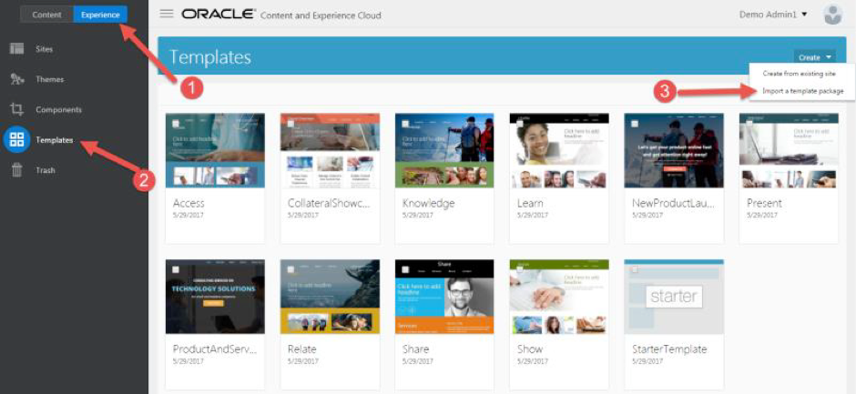
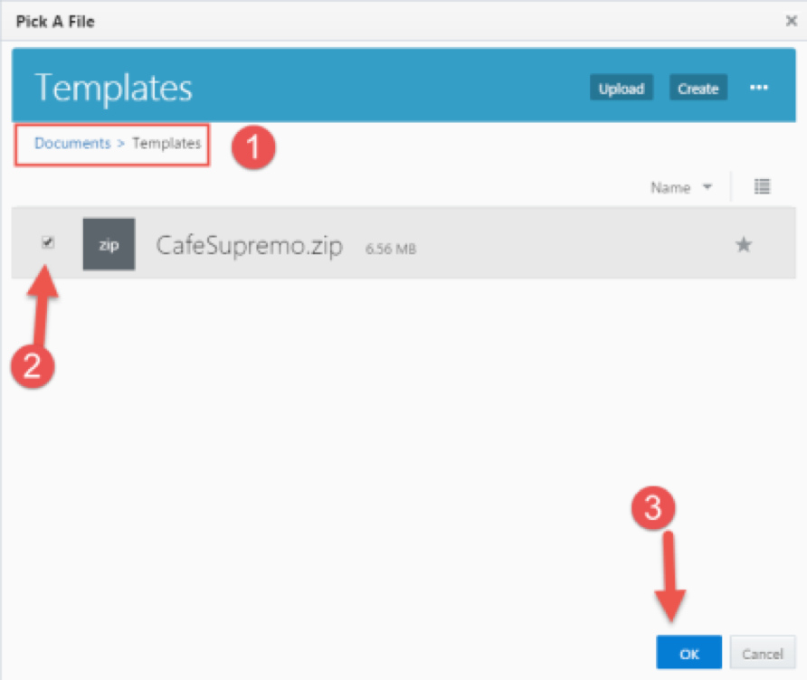
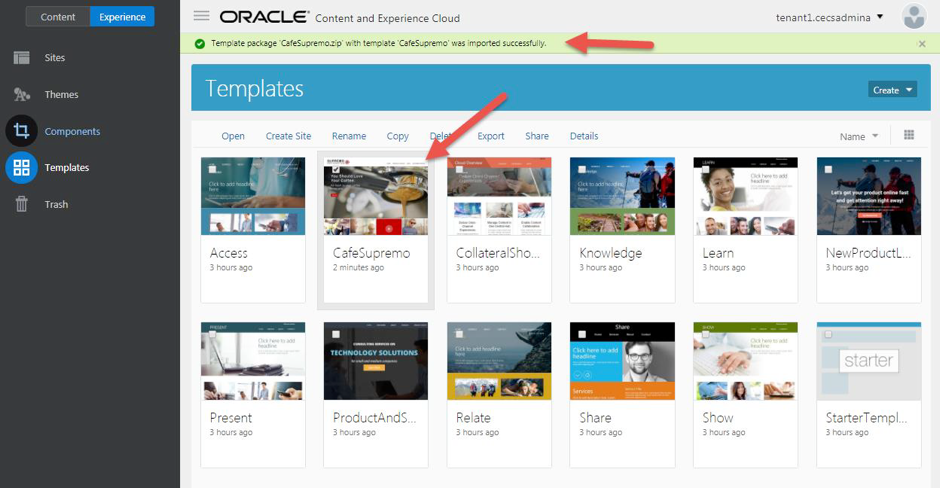
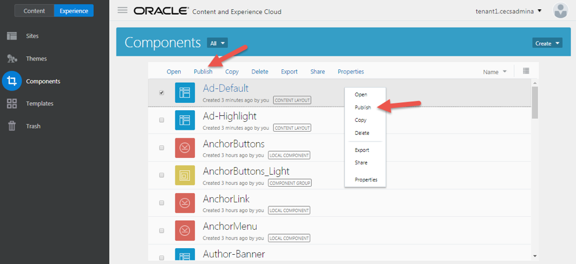
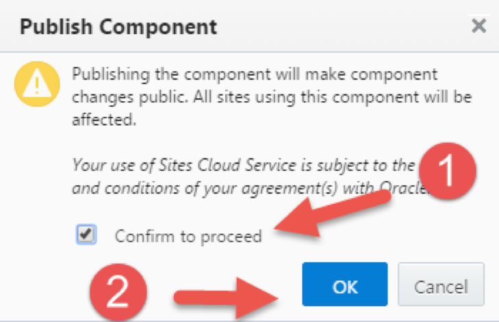
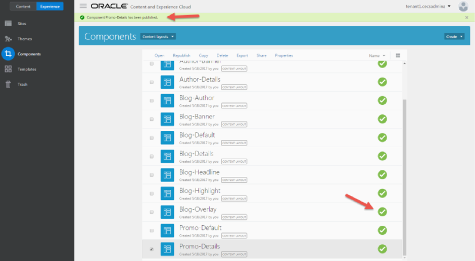

# ORACLE Cloud Test Drive #

## Facilitators Instructions ##

### Introduction ###

These steps will show you how to setup the participants environments before commence of the Test Drive.

**Note these steps will need to be repeated for all instances that will be used in the test drive session**

You will be setting up the following: 

1. Create a site using template and create a collection. 
2. Create and publish content items 
3. Learn how to use the content items in sites 

>For a quick view on Content and Experience Browser user interface please click [here](https://docs.oracle.com/en/cloud/paas/content-cloud/user/quick-overview-your-browser-home-page.html).

## Lab Resources ##

1. [CafeSupremo.zip](../resources/CafeSupremo.zip) - CafeSupremo Marketing site template and components 
2. [Images.zip](../resources/Images.zip) – Images required for the CafeSupremo Marketing site.

>**Note:** Click on the links to download the resources to your local machine.

## Upload Lab Resources to Content and Experience Cloud ##
### Upload Resources ###

1. Login to CEC. 
2. Create a folder in ``Content -> Documents`` called **“Templates”** 
3. Upload or Drag and Drop the CafeSupremo.zip file into the **“Templates”** Folder

 
4. Unzip **Images.zip** into a local folder 
5. Upload or Drag and Drop all images into ``Content -> Digital Assets``. This may take several minutes to import all images. 

6. Click the **Close** button to close the upload pop up window. 

## Import Template and Components ##

### Import Template ###

1. Navigate to ``Experience -> Templates``. Click ``Create -> Import`` to import a template package.

2. Select the Templates folder, then select the CafeSupremo.zip and click **“OK”**. 

>Note: If you are prompted to replace or create a new component, just except the default by clicking **OK**.

 

3. You have successfully imported the template. 

### Publish the Components ###

1. Navigate to the ``Experience -> Components`` page 
2. Select the components and click the **“Publish”** link. You may also select the component and right click to bring up the context menu to publish the component. 
The menu bar will not appear until a selection is made. 

**_Note:_**

>You need to repeat this step until all content layout components are published. 

>If you have too many components and you only want to select the content layout components, you can use the components filter to display only the content layouts component. 

3. On the publish component page, click **“Confirm to proceed”** and then OK to publish the component. 

4. You have successfully published the component. 

