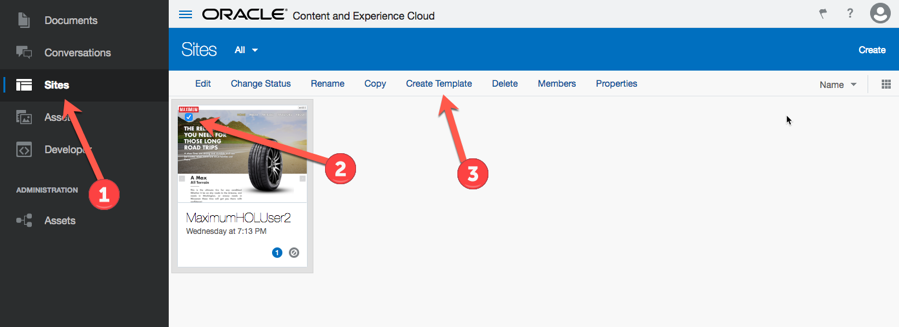

# QuickStart for Oracle Content and Experience (OCE)

## 1.	Introduction
In this lab, you will learn how to build an enterprise website  with Oracle Content & Experience Cloud (CEC).
The objectives of this lab are to:

1. Learn how to create a digital asset repository
2. Learn how to create a site using template and use the asset in an enterprise microsite
3. Learn how to create content item for your site. 
4. Learn how to create and export a template using your site.

### Resources

1. [Maximum.zip](template/Maximum.zip) - Maximum HOL site template and components 
> Note: Resources are already installed on your OCE instance. You can skip this step
 
## 2.	Environment

CEC Environment:  to be shared with you
You will be presented with a login box.  Login with the username that was assigned to you at the beginning of the Lab by the instructor. It will be in the form of **holuser<number>**. 
After login you should see a UI that looks like this.


Note:  When you see <User ID> in this lab guide, please replace it with the CEC user id assigned to you so you can easily identify the setting or items that you changed or created.

 
## 3.	Create A Site Using Template
Before you can create a site using a template, you need to create a Repository for the site assets (e.g. images, content items etc.)
Click on the **Assets** menu on the left under the Administration section of the menu, then click on the **Create** link to create a Repository for the site assets.

 

On the Create Repository screen, enter **Maximum-<User ID>** as the name of the repository and select English (United State) (en-US) as the default language. Click on the **Save** link to save the repository.

For example:


 

Now you are ready to create a site. 
Click on the **`Site`** menu on the left, then click on the **Create** button on the right side of the screen.

 

You will see an imported template called Maximum template, select the template and click on the **Next** button.

 

On the create site screen, 
1. Enter **Maximum<User ID>** as the name of the site
2. Select **Maximum-<User ID>** repository as the site asset repository
3. Ensure the **Site Prefix** has **maximum of 15 characters and unique in a CEC instance**, since we are using a shared CEC instance, please change it to **max<User ID>**.
4. Click on the **Create** button to create a site. For example:

 

Once you create the **Create** button, you will see the Create site message and status appear at the top of the screen. 


The create site process will take few minutes complete as it will create the following components for the site:
1. 2 Content Types
2. A Publishing Channel
3. A Site Collection

It will also import all digital assets from the template and create the content items using the 2 content types.
Once the site creation process is completed, you will see a message **“Site Maximum<User ID> was created successfully”**, For example:
 


Navigate to the Assets under Administration section, then from the drop-down list, select Content Types to review the content type created using this site template.

 

You will see 2 content types below:


Click on one of the content types, for example **Maximum_Article**, to open the content type definition screen.  From this screen, you will see there are 5 data fields assigned to this content type, you can click the **Edit** link for each field to review the field definition.  Click on the **Close** button to close this screen.


From the **Assets** drop down menu, select **Publishing Channels**. 


A publishing channel has also been created called **Maximum<User ID>**, for example:


Click the **Maximum<User ID>** channel to open the **Edit Publishing Channel** screen to review the channel definition. Click on the **Close** link to close the screen.


    
Click on the **Assets** to review the **Digital Assets** and **Content Items** created for this site, select the **Maximum<User ID> Site** collection. For example:

 

 
## 4.	Edit and Preview a Site
To edit or preview the site, click on the **Site** menu and select the **Maximum<User ID>**, then click on the **Edit** link to open the site builder to edit the site.


Give a name for your update, for example: **OOW-<User ID>**, then click on the **Create** button to create a version of your site update.
    

 
It will then open a new browser tab with the site builder and the site you created for update.  To preview the site, click the preview button  to preview the site.
 


You may now close the preview tab and the site builder tab.  Next, we will create a new **Article** content item and see it render on the site.

## 5.	Create a content item
To create a content item, Click on the **Assets** menu on the left, then the **Create** button on the top left and select **Create a new Content Item** from the drop down list.


Then enter the following information in the Create Content Item screen, then click **`OK`**.

+ Content Type : **Maximum_Article**
+ Name: **Porsche 356 Roadster**
+ Description : **The 356 can fairly be described as the car that put Porsche on the map, the unconventional rear-mounted flat-four engine...**
+ Collections: **Maximum<User ID>DefaultCollection**
+ Targeted Channel : **Maximum<User ID> Channel**
+ Language : **English (United States) (en-US)**


+ Image 280x210: Porsche 356 Roadster 280x210.jpg
+ Image 1000x562 : Porsche 356 Roadster 1000x562.jpg
+ Category: Life

>After you copy and paste the content data below in the content field, select all the text and click on the **Remove** Format button to remove the text format, we will be using the stylesheet to format the content.


+ Content : 
```The 356 can fairly be described as the car that put Porsche on the map, the unconventional rear-mounted flat-four engine starting a tradition that continues to the present day.
As the first serial production car to wear the Porsche name, the 356 was the car that set the company firmly on the path to success in the worlds of sporting road cars and motorsport. The first 356 was a relatively simple car that shared its basic layout with the Volkswagen, utilizing a monocoque chassis design and a highly reworked version of the VW’s flat-four cylinder engine slung out behind the rear axle. For his own car, Dr. Ferdinand Porsche dramatically improved the VW engine with new heads, new cam, new crankshaft and other internals, as well as adding a dual carburetor intake. The very first Porsche car hit the road in Austria in 1948, and as the 1950s progressed, fewer and fewer VW parts were used in production. The end result of Dr. Porsche’s methodical refinement was a free revving engine that produced double the horsepower of the People’s Car. True to the Porsche Ethos, the 356 itself was continuously being refined and revised over its 17 year production run, without ever being fully redesigned at one time. By the time 356C production ended in 1965, horsepower had nearly doubled again from the first 356s and the car had gained four wheel disc brakes and a host of mechanical, styling and trim refinements.

As with any long-running automobile, each evolution of the chassis has its own group of dedicated fans. For many drivers and collectors, the 356B remains the sweetest and best balanced of the lot, both in terms of performance and styling. A wide variety of body styles graced the basic 356 shape over the years. From coupes to cabriolets and everything in between, Porsche offered a body style to appeal to a wide range of enthusiasts. Perhaps the purest expression of the 356 as a driver-focused sports car was the Speedster. The Speedster first appeared in 1955 at the urging of the influential American importer, Max Hoffman. Hoffman believed that a stripped down, lower cost 356 would sell well in America, particularly in sunny California where sports car racing was all the rage. Hoffman’s hunch proved right and the Speedster was an instant hit. Unlike the Cabriolet, the open topped Speedster had a rakish cut down windscreen, fixed-back bucket seats, side curtains in place of door glass, and a rudimentary folding top. The car was lighter, cheaper and faster than its siblings, and had a unique, simplistic elegance to its appearance. Production was relatively short however, running from 1955 through 1958. As customer demand for such a basic sports car waned, Porsche changed the formula to keep buyers happy. The replacement Convertible D was little more than a Speedster with a taller windscreen and roll up windows. A more thoroughly redesigned replacement for the Convertible D came in 1960, named the Roadster. The Roadster still retained similar lines to the Speedster, but like the D included full weather equipment, roll up side glass and a further refined styling of the Karosserie Drauz-built bodies. The 1600 engine gave brisk performance, and the Roadster remained the sporting choice, as the cabriolet was slightly heavier. Roadster production only lasted through early 1962, when the Cabriolet became the only open 356 option.

This attractive 1960 356B Roadster is a numbers-matching example that has been treated to a recent comprehensive restoration with an emphasis on driving and enjoyment. It is finished in a very crisp color combination of Bali Blue over a red leather interior with a gray squarweave carpets and a black Stayfast top. The paint and bodywork are fresh, with very good, consistent panel gaps throughout. The chrome and brightwork are excellent, and the car rides on a nice set of chrome wheels and excellent Vredestein tires. 
The numbers-matching 1600 Super engine &ndash; as verified by the Porsche Certificate of Authenticity - has been recently upgraded with twin Weber carburetors for performance and ease of service, though purists can rest assured that the original carburetors are included in the sale. The engine is nicely detailed and very well presented appearing extremely fresh. Likewise, interior is beautifully presented, with the smell of fresh leather still strong in the cabin; the red upholstery beautifully contrasting the blue paint. The correct squareweave carpeting is executed in an attractive gray color, and a deluxe steering wheel greets the driver.

The 356B roadster is one of the rarest and most desirable open 356s. Drum brake Bs are an absolute joy to drive, with delicate steering, a torquey smallbore engine that thrives on revs and gorgeous, timeless styling. Combining the simplistic charm of the Speedster with a bit more comfort and convenience, the Roadster makes a fabulous driver’s car for all conditions. Recent mechanical and restoration work totals over $40,000, making this very well sorted and attractive example ready for enjoyment.
```
+ Date: **<Enter today’s date>**


 
Once you finished the editing, click the **Save** button to save the content item


To preview the site with the new content item, click on **Site** menu and select the **Maximum<User ID>**, then click on the **Edit** link to open the site builder to edit the site.
 


Click on the pencil to open the last site update you saved in previous step.


On the **Home** page in the site builder, you will see the new content item appears as a new article.


Click the **`preview`** button  to open the site in preview mode, then click on an article you just created to view the article details.
 

 


 
## 6. Create a Template
If time permits, you can create a site template using the **Maximum<User ID>** site you just created. 
Select **Sites** from the left menu, then select the **Maximum<User ID>** site you just created, click on the **Create Template** link to create a template.


    
Enter a name of the template, e.g. Maximum<User ID>_Template, then check the “Include unpublished content items and digital assets in your template”, click on the **Create Template** button to create a template.


 
Once the template is created successfully, you can click on the **Templates** link to the templates screen to download the template.


>Note: You can also create on the “Developer” link from the side menu, then select the Template button to view the templates you have permission to access in CEC.

From the template screen, you will see the template you just created.  Select your template,  then select the Export link to export your template to a CEC folder.


Click on the **`Create folder`** link to create a new folder:


Enter the **folder name**, for example: Templates. Click on the **`Create`** button to create a folder


Select the **“Templates”** folder you just created, then click on the **`OK`** button. 


You Maximum<User ID>_Template template will be exported to the Templates folder as a zip file, you can download the zip file to your USB stick or email to your own account.  You can import and use this template in your CEC instance.


    
>Note:  You can also download the template zip file from the Documents->Templates folder.


