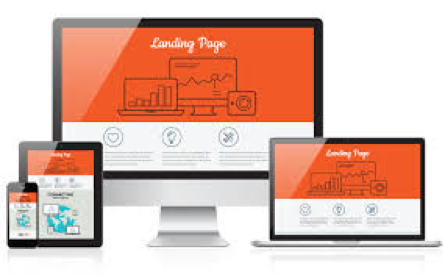
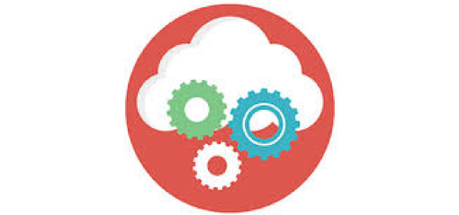

# Lab 3: Get Started with Building a Content Driven Microsite
 
## OBJECTIVE:
This 6 minute video shows how to build your very own 2-page site from scratch with Content and Experience Cloud. The objective is to enable the customers and other stakeholders to leverage simple, step-wise guided videos for creation of a content-centric microsite with embedded documents, templates, discussions and more.

Part of the Oracle Cloud Platform, Oracle Content and Experience Cloud delivers a single cloud-native platform for content production, management, and delivery across all lines of business. It provides unique capabilities to support a variety of business needs, from employee and customer engagement, to sales enablement and business development. 
The site example shown in the video uses a template that was adapted from the template list which has been uploaded in the GITHub page. To get started quickly with CECS you can also use OOTB templates provided with CEC or get a pre-built bootstrap theme which a developer can easily adapt to make editable in CEC.

The primary persona for showcasing the site creation is a marketer who interacts with the building of the site.

In the video, you will learn to create a site from a template. Then it also showcases editing the site, adding a template, adding layouts for a site content in the site, add content to the site, add a page, and add a conversation component. 

> Note: You can extend this demo easily by showing how to add additional components, publish the site, and taking the site online.

## STEPS INVOLVED:
+ Step 1: Creating a site from empty template (these assets are added in the GiTHub page)
+ Step 2: Add a second page in the site (About Us). Please note that this is provided as a PDF document in the GitHub repository.
+ Step 3: Creating a Site Menu and Navigation (Again available as part of the repository)
+ Step 4: Define Header along with Logo (Suggestion is to use customer logo)
+ Step 5: Creating the page structure using section layouts. (Components included as part of the OOTB instance)
+ Step 6: Define and Add the content on each Page (Content Assets are included as part of the repository available in GitHub)
+ Step 7: Publish the site

> You can find all the supporting files in the following folder: [Resources/Materials](/Resources/Materials)

To summarise, the video illustrates a real use case scenario based on one of the key use cases of microsite creation leveraging CECS. Watch the Video here: [Creating Static Sites](Resources/VideoTutorials/Creating-Static-Sites.mp4)

 

[Back to CECS QuickStartKit Home](README.md)