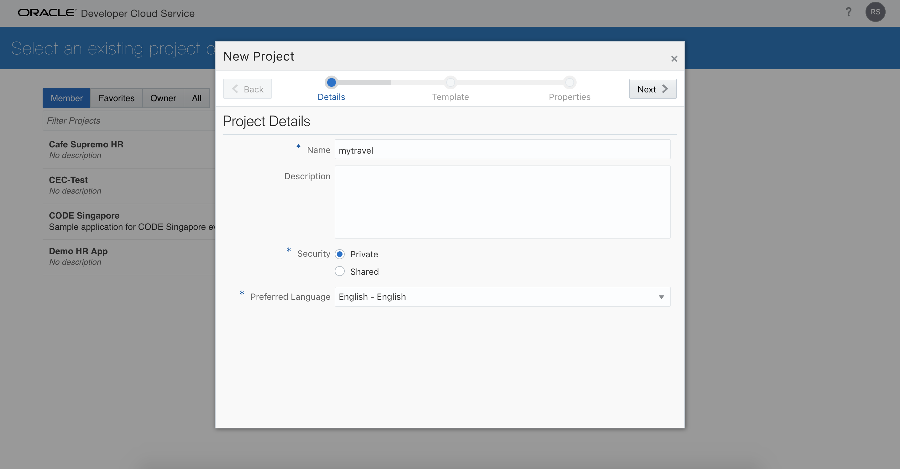
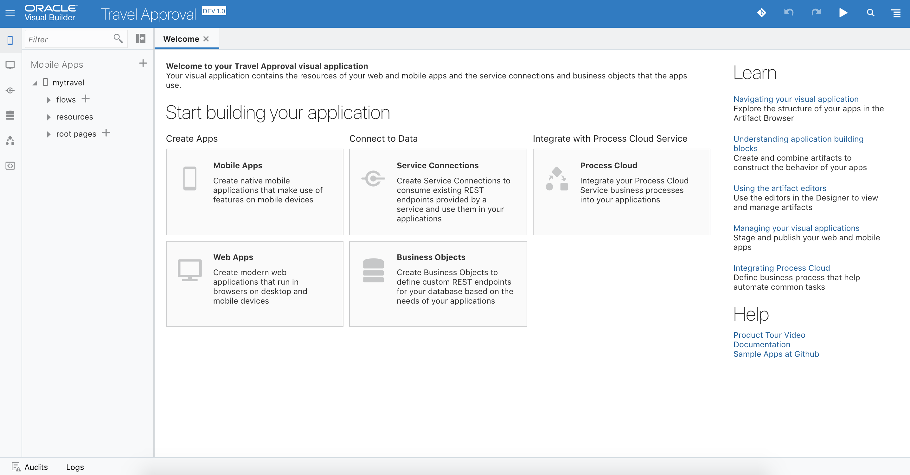
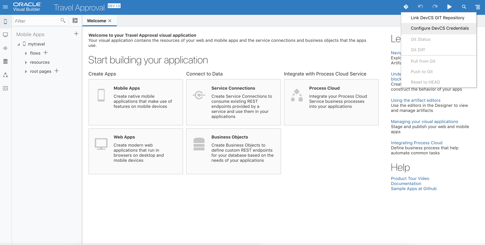
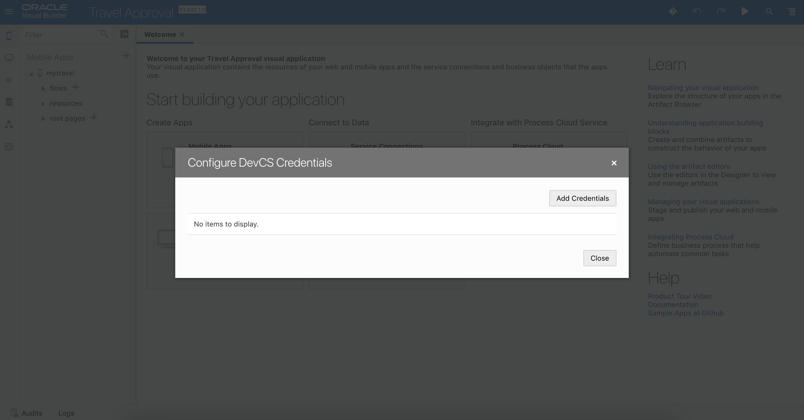
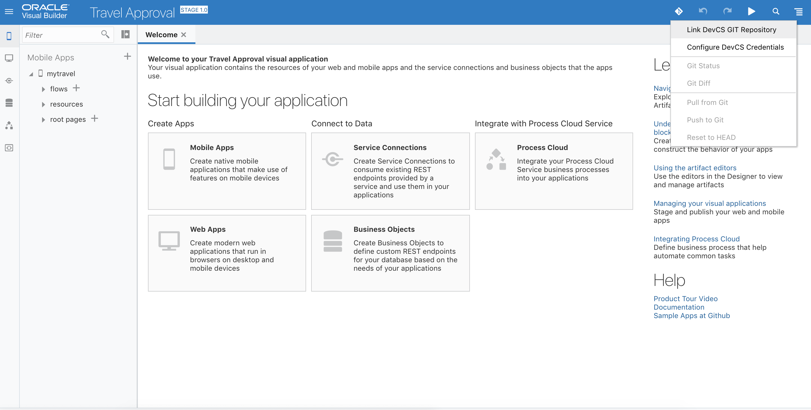
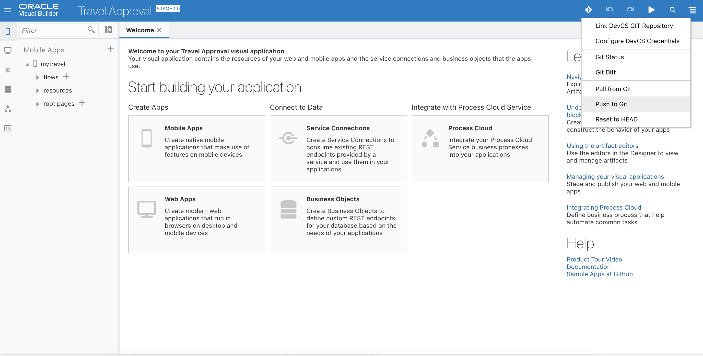
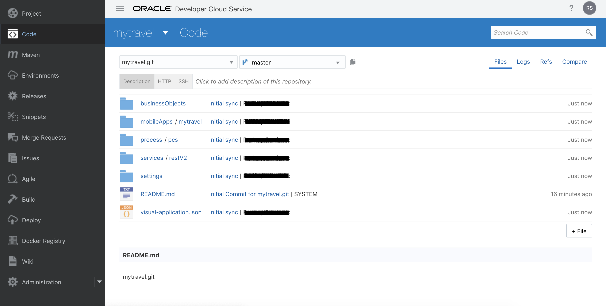

# ORACLE Cloud Test Drive: Autonomous Visual Builder Cloud Service

## Setting up Developer Cloud for Visual Builder

### Introduction
Developer Cloud provides you a streamlined and automated "development to delivery" process with a unified integrated solution. 

**Plan and Manage**

- **Issue Tracking** -
Track and prioritize tasks, defects, and features
- **Team Management** -
Assign ownership and track team execution
- **Agile Dashboard** -
Manage and track development sprints

**Code**
- **Version Management** -
Manage code with hosted Git repositories
- **Code Review** -
Conduct peer code review and comment directly on code
- **Track Changes** -
Associate code transactions with issues

**Build and Deliver**
- **Continuous Integration** -
Automate build, test, and delivery with popular frameworks
- **Orchestration** -
Orchestrate and monitor scalable complex builds
- **Deployment Automation** -
Streamline deployment to Oracle Cloud Services or on-premise environments

**Team Collaboration**
+ **Activity Stream**
-Stay informed on project activities with a live feed
+ **Wiki**
-Share knowledge, documents, and information
+ **Web Dashboard**
-Access all your project information from anywhere

### 1. Create a project in Developer Cloud

Click **`+ New Project`** a dialog window will open

In the Name field, fill in **<Your Name>-mytravel**. Set the `Security` option to **Private**, and select your `Preferred Language` or keep the default setting.
Click **`Next`**.
	

Select the **Initial Repository** Template. This will create a project with an initial repository.
Click **`Next`**.

Select your **Wiki Markup** or keep the default. For `Initaial Repository` select the **Initialize repository with README file** option.
Click **`Finish`**.

Developer Cloud will now prepare the project.

Once completed you will see your project and the git repositories that has been created for you.

Before you continue, copy the **mytravel.git** URL under the **repositories** section on the right. You will need this for the next step.

### 2. Link your Application to Developer Cloud

Return to your VBCS application.

Click on the GIT Icon left to corner and select **Configure DevCS Credentials** menu option.

The **Configure DevCS Credentials** dialog box will open, now click **`Add Credentials`**

Fill in:
+ DevCS URL: The URL you have copied earlier. 
+ DevCS Username: Your username
+ DevCS Password: Your password

> Note eg. https://`username%40oracle.com@`developer.us2.oraclecloud.com/developer-gse00000000`/s/developer-gse0000000_mytravel_27505/scm/mytravel.git` reduce to
`https://developer.us2.oraclecloud.com/developer-gse00000000/`

Click **`Save Credentials`**. 

Click **`Close`**.

Now we have setup the DevCS credentials, next step is to link the repository in DevCS to your application in VBCS.

Click on the GIT Icon left to corner and select **Link DevCS GIT Repository** menu option.

The **Linked DevCS GIT Status** dialog box will open, now click **`Add Link`**

Select the following:

+ DevCS URL with Credentials: The URL pointing to your DevCS
+ Project Selection: **mytravel**
+ Repository Selection: **mytravel.git**
+ Branch Selection: **master**

Click **`Save Configuration`**.

Verify the result and click **`Close`** to continue.

### 3. Push your build to Git repository in Developer Cloud
At this stage you have completed the configuration for DevCS and you can start pushing your development to DevCS GIT Repository.

Click on the GIT Icon left to corner and select **Push to GIT** menu option.

The **Push Content to GIT Repo** dialog box will open.

Commit Message: **Inital Sync**

Click **`Push to Git`**. 

As a result you should see the following when completed.

### 4. Verify the result in Developer Cloud
Now return to your DevCS environment and you will see the latest activities on your Summary page.

Click on the left top **hamburger** menu.

Click **`Code`** menu icon.

Now you can see the code that has been pushed from VBCS to your DevCS.

You have completed this lab.
> [`HOME`](../README.md)
