# Lab 100: Prepare Your Cloud Environments

## Preparing Database Cloud Service, Java Cloud Service, Application Container Cloud Service and Developer Cloud Service

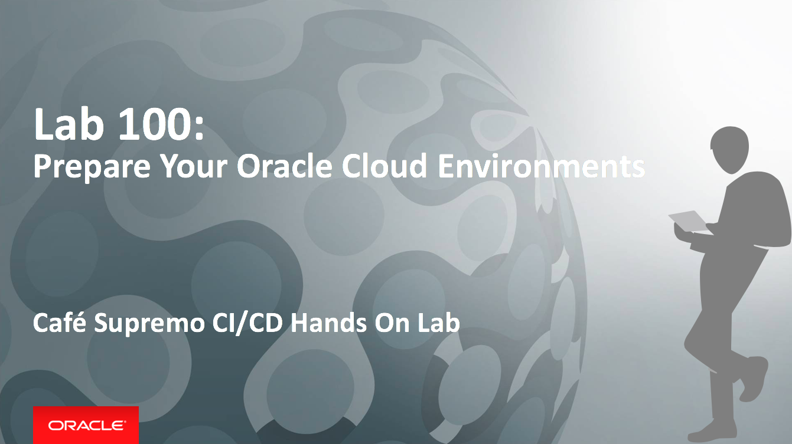

During this part of the lab, you will take on the **DevOps Engineer Persona**. You will provision the required cloud services for Developer Cloud Service to build and deploy to a WebLogic Server cluster in Java Cloud Service and Application Container Cloud Service instance. You must have access to a:

- GitHub account
- Oracle Public Cloud Service account including Java, Application Container, Developer, Database and Storage Cloud Service

The current release of the application no longer requires a database for storing customer data. Customer data is now stored in a ACCS cache and is automatically populated upon the start up of the RewardService ACCS instance. This is to keep the lab duration short and to avoid the laborious effort in uploading the data to a database. However, a database would be required as a persistent storage in real case scenario.

An Oracle Database Cloud Service is still required by Java Cloud Service to host the Oracle Fusion Middleware component schemas used by Oracle Java Required Files (JRF).

### About This Exercise

In this exercise, we will:
- Create and configure a Database Cloud Service (DBCS) instance to hold the JCS (WebLogic) configuration
- Create and configure a Java Cloud Service (JCS) (WebLogic) instance to host the JET UI frontend
- Create and configure a Application Container Cloud Service (ACCS) to host the Node.js backend Reward Service
- Create and configure a Developer Cloud Service (DevCS) Build VM to build our application

## Provision a Database Cloud Service (DBCS) Instance

### **STEP 1**: Sign Into The Oracle Cloud Service Account

- Sign into your Oracle Cloud Service account

### **STEP 2**: Create a DBCS Instance

- On the dashboard click the hamburger icon on the **Database** tile and select **Open Service Console**

  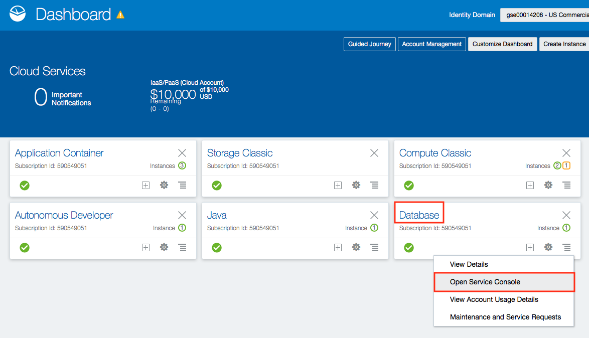

- Once in the Database Cloud Service Console page, create a new instance by clicking **Create Service** button

### **STEP 2.1**: Basic Instance Configuration

- Complete the Create Instance Page as illustrated below:

  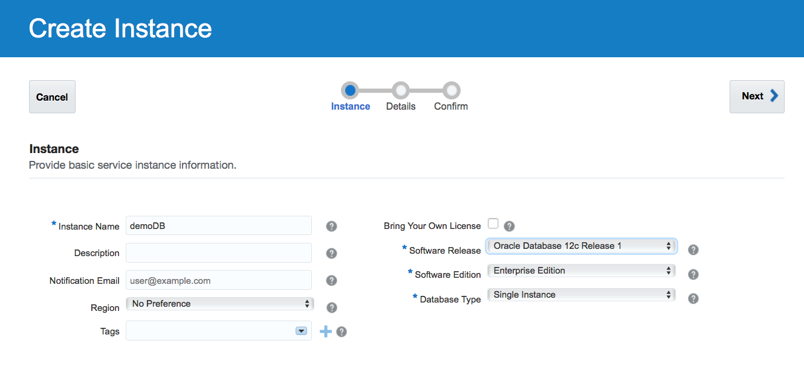

- Enter the following parameters:

  - **Instance Name**: `demoDB`
  - **Software Release**: `12c Release 1 Software`
  - **Software Edition**: `Enterprise Edition software edition`
  - **Database Type**: `Single Instance`
  - Leave the rest to default

- Click **Next**

### **STEP 2.2**: Detailed Instance Configuration

The last input page is the Service Details page.

  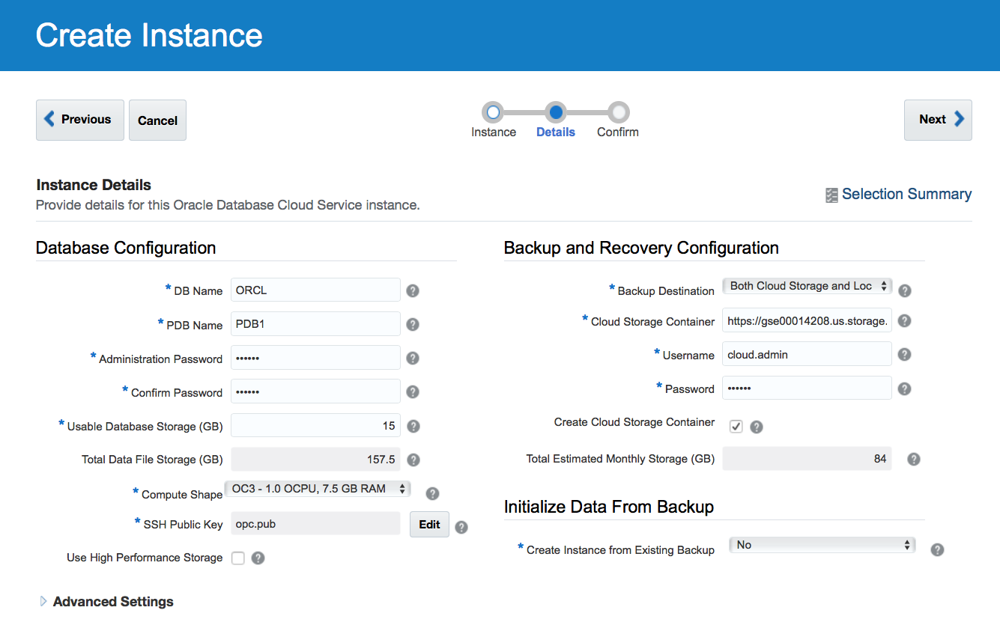

The following parameters have to be provided:

  - **Administration Password**: DB's password. Please take note of the password.
  - **Compute Shape**: `OC3 - 1.0 OCPU, 7.5 GB RAM` This is the smallest (default).
  - **SSH Public Key**: Provide a public key which will be uploaded to the VM during the creation. It allows you to connect to the VM through ssh connection using the private key.
    - If you don't have or want to  to create different keypair select **Create a New Key** option and download the newly generated keypair for later usage
  - **Storage Username**: Your Oracle Cloud username e.g. `cloud.admin`
  - **Storage Password**: Cloud Account password
  - **Create Cloud Storage Container**: Leave to default of `Checked`
  - **Create Instance from Existing Backup**: Leave to default of `No`

- Click **Next**

- Confirms the details on the next page and then click **Create**

**NOTE**:  Your DBCS instance will take about 30 minutes to complete. Please wait until the DBCS instance has been completed before creating a JCS instance. Whilst we are waitinf for the DBCS instance to be provisioned, we can work on other infrastructure components such as ACCS.

*Please move on to the next section whilst you're waiting for the DBCS instance to be provisioned.*

## Provision Application Container Cloud Service (ACCS) Cache

### **STEP 3**: Create a ACCS Cache Instance

- On the dashboard click the hamburger icon on the **Application Container** tile. Select **Open Service Console**.

  

- Once in the Application Container Cloud Service Console page, click the hamburger icon by the **Welcome!** text at the top right corner and then select **Application Cache** by scrolling down the the list as shown below.

  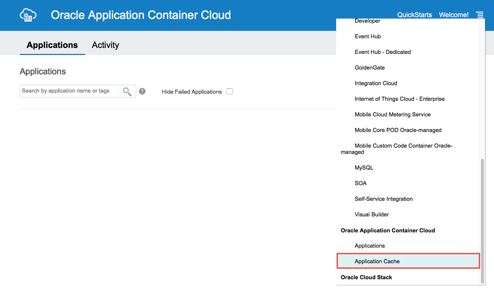

- On the Application Caches page, create a new instance by clicking **Create Instance** button.

### **STEP 3.1**: Instance Configuration

- Complete the new Create New Instance Page as illustrated below:

  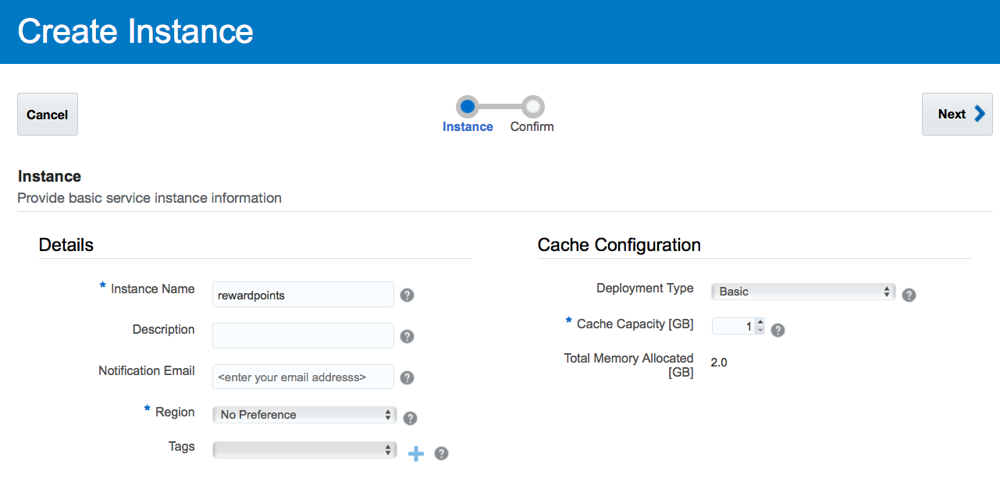

- Enter the following parameters:

  - **Instance Name** `rewardservice`

  - Leave evertyhing else to their defaults

- Click **Next**

- Click **Create** on the Confirm Page

**NOTE**: Your ACCS Cache instance will be ready in about 10 minutes.

Once completed, you will find the **rewardservice** cache instance available to use as illustrated below.

  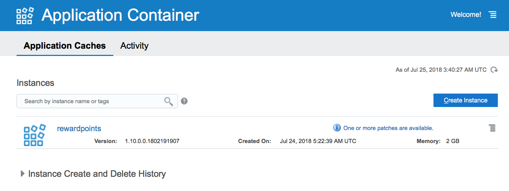

*You have now completed the provisioning of an ACCS Cache instance for use with an ACCS application instance.*

## Provision a ACCS Application Instance

### **STEP 4**: Create a ACCS Application Instance

- Go back to the Application Container Service Console

- Click **Create Application**

- Click on the **Node** icon to select your application platform in the **Create Application** popup box

  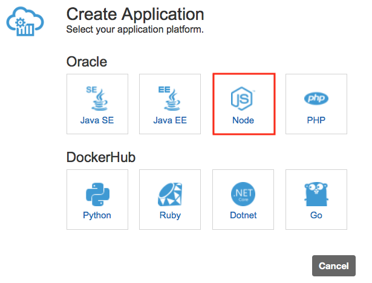

- You are now presented with the **Application** configuration popup box

  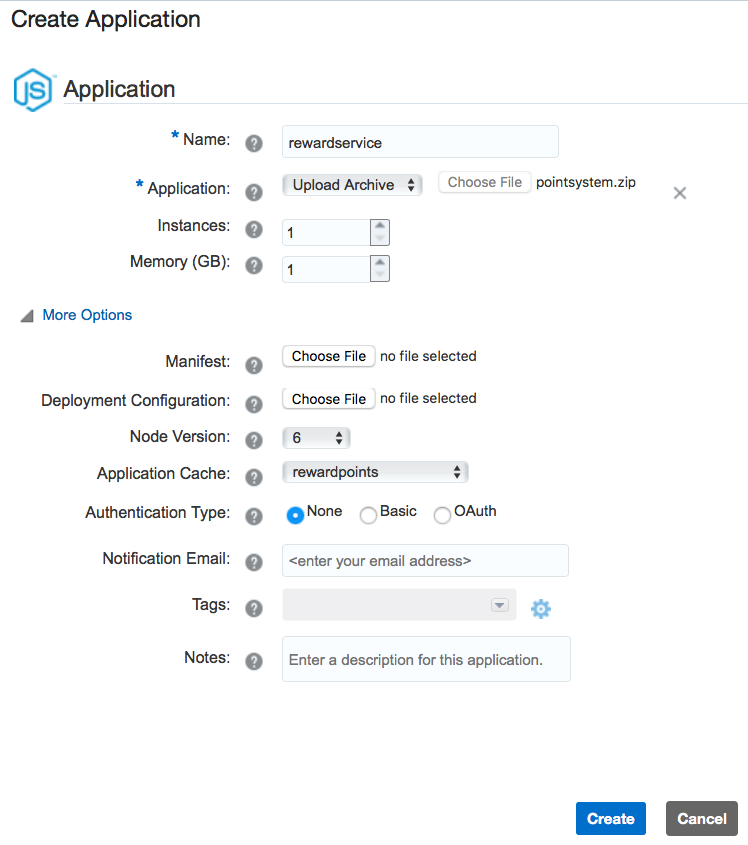

- Enter the following parameters:

  - **Name:** `rewardservice`
  - **Application:** Click on Choose File to Upload Archive
    - Select `pointsystem.zip` from your folder
    - The `pointsystem.zip` can be downloaded it here. You must be an Oracle employee to download this.

  - **Instances**: `1`
  - **Memory (GB)**: `1`

  - Click on **More Options** to expand the configuration page

  - **Application Cache**: Select `rewardpoints` from the dropdown box. This is Application Cache you created in the previous step

- Click **Create**

**NOTE**: Your ACCS Application instance will be ready in about 10 minutes.

Once ready, you will find your rewardservice available in the Application Container Service Console.

- Take note of the instance URL.

  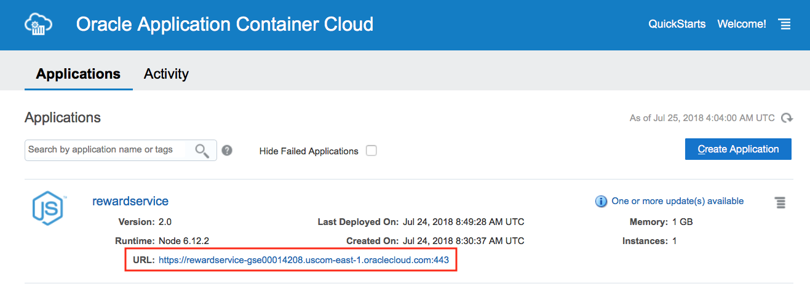

*You have now completed the provisioning of the Reward Service Node.js ACCS application instance.*

## Provision a Java Cloud Service (JCS) Instance

For this part of the lab, you would need a DBCS instance to complete the JCS configuration.

- Please verify the provisioning of a DBCS instance in **Step 2** has completed and is up and running

- If this is running, then proceed to the following steps, otherwise, please wait until it is ready.

### **STEP 5**: Create a JCS Instance

- On the dashboard click the hamburger icon on the **Java** tile. Select **Open Service Console**.

  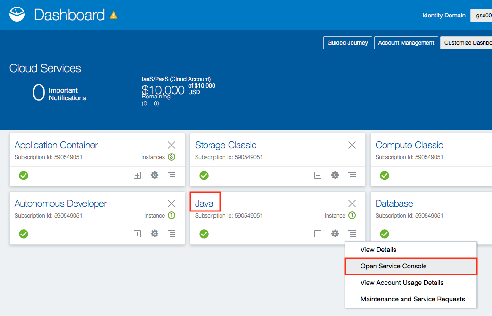

- Once in the Java Cloud Service Console page, create a new instance by clicking **Create Service** button.

### **STEP 5.1**: Basic Instance Configuration

- Complete the new Create New Instance Page as illustrated below:

  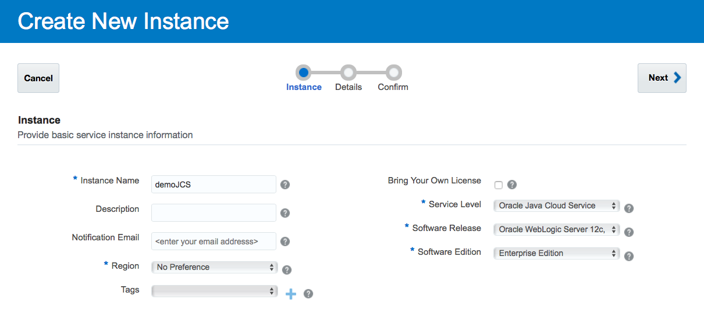

- Enter the following parameters:

  - **Instance Name**: `demoJCS`
  - **Service Level**: `Java Cloud Service`
  - **Software Release**: `12c Software Release (12.2.1.2)`
  - **Software Edition**: `Enterprise Edition software edition`
  - Leave the rest to default

- Click **Next**

### **STEP 5.2**: Detailed Instance Configuration

- On the Service Details page, click **Advanced** to show additional configuration options

  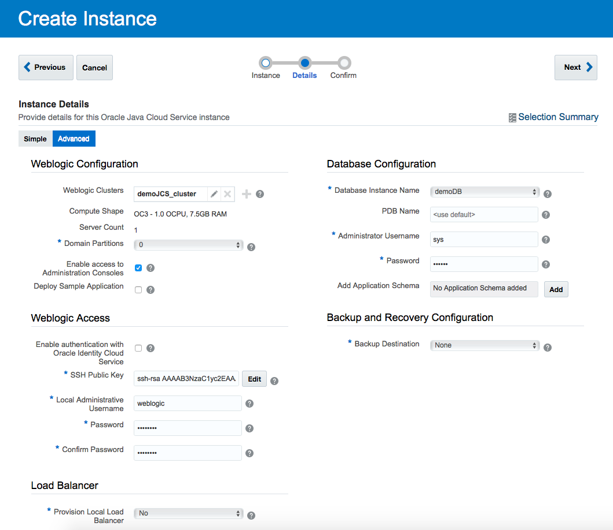

The following parameters have to be provided:

  - **Shape**: `OC3 - 1.0 OCPU, 7.5 GB RAM` this is the smallest one (default)
  - **Server Count**: `1` which means one managed server
  - **Domain Partitions**: `zero` for no partitions (default)
  - **Enable access to Administration Console**: `Checked` to get access to the Admin console
  - **Deploy Sample Application**: `Unchecked`
  - **Enable authentication with Oracle Identity Cloud Service**: `Unchecked`
  - **SSH Public Key**: public key which will be uploaded to the VM during the creation
    - It allows to connect to the VM through ssh connection using the private key.
    - Click on **Edit** button and select the same publicKey what was generated for Database Cloud Service instance    
  - **Username**: `weblogic` username of WebLogic administrator
  - **Password**: WebLogic administrator's password. Don't forget to note the provided password.
  - **Database Instance Name**: `demoDB` Database Cloud Service name to store WebLogic repository data. Your provisioned DBCS instance will appear in the dropdown list.
  - **PDB Name**: `<use default>` If you have choosen default (PDB1) during Database Cloud Service creation then leave the default here too
  - **Administrator User Name**: Enter: **sys**. DBA admin to create repository schema for Java Cloud Service instance.
  - **Password**: DBA admin password you provided during Database Cloud Service creation
  + **Add Application Schema**: `No Application Schema added`
  + **Provision Load Balancer**: `No` to save resources, we will not create a Load Balancer instance
  + **Backup Destination**: `None`

- Click **Next**

The final page is the summary page about the configuration before submitting the instance creation request.

- Click **Create** to start the provisioning of the new service instance.

When the request has been accepted, the Java Cloud Service Console page appears and shows the new instance. The instance now is in Maintenance (Progress) mode. Click **In Progress** link to get more information about the status.

**NOTE**: Your JCS instance will be ready in about 30 minutes. Whilst we are for the JCS instance to be provisioned, we can work on other components such as Developer Cloud Service.

*You have now completed the provisioning of the JET UI frontend JCS instance.*

## Provision a Developer Cloud Service (DevCS)

You have two choices for Developer Cloud Service:

  - Traditional Developer Cloud Service
  - Autonomous Developer Cloud Service

It is recommeneded to use the Autonomous Developer Cloud Service as it offers a dedicated Build VM for your build jobs. This has significant performance improvement over the Traditional Developer Cloud Service and would result in much faster build time. The use of the Autonomous Developer Cloud Service is particularly important as one would see the full potential of our service and would bring out the key benefits in Continuous Integration and Continuous Delivery.

Oracle Developer Cloud Build VMs runs on Oracle Linux 6 or Oracle Linux 7, and supports a variety of software such as Node.js, Docker, and Oracle SOA Suite. The platform and the software in Build VMs are defined by Build VM templates.

### **STEP 6**: Open the Automonous Developer Cloud Console

- Ensure you are opening the Autonomous DevCS and NOT the Traditional DevCS

- On the dashboard click the hamburger icon on the **Autonomous Developer** tile. Select **Open Service Console**

  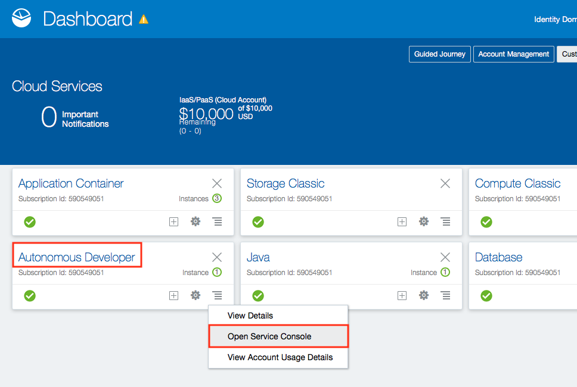

### **STEP 6.1**: Create a VM Template

In this section, you learn how to create a basic Build VM template that includes the minimum required software.

- Select **Organization** from the user name dropdown options

  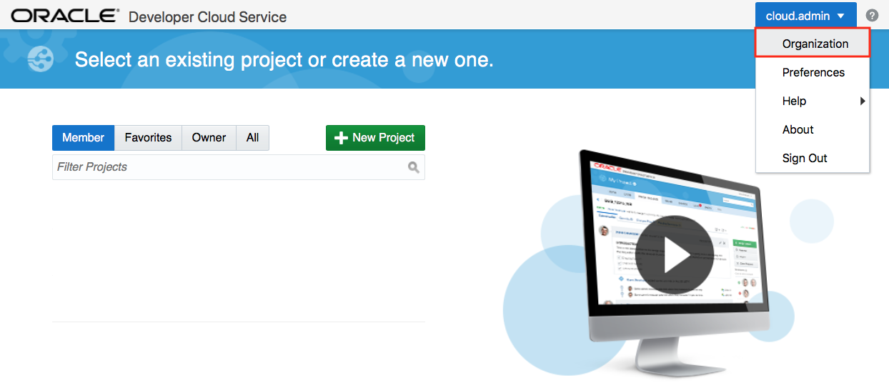

- Click **VM TEMPLATES** on the Organization Administration page

  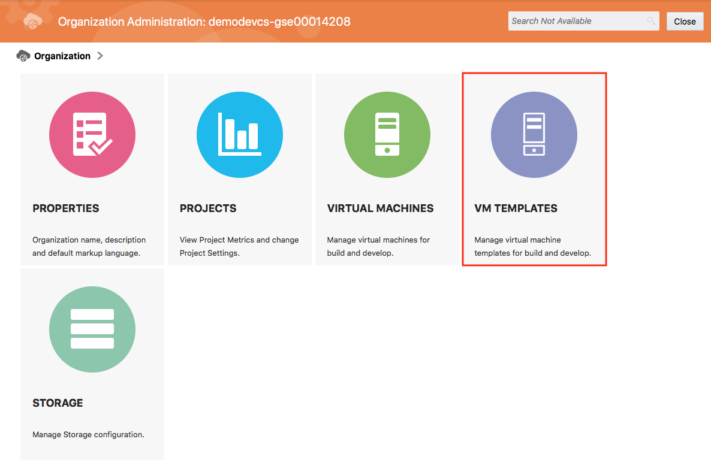

- Click **New Template** in the Build VM Templates page

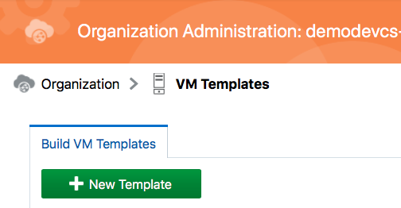

- In the New VM Template dialog box, enter the following details:

  - **Name**: `CafeSupremo`
  - **Description**: `A Build VM template with minimum required software`
  - **Platform**: `Oracle Linux 7`

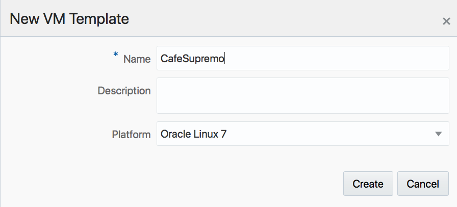

- Click **Create**

A Build VM template named **CafeSupremo** is created. It includes just the required Build VM components. The right side of the page displays the details for this Build VM.

### **STEP 6.2**: Configure the Software of a Build VM Template

The CafeSupremo template contains the minimum software required to run basic builds. We need to add additional software to the template in order to build our JET UI frontend and Node.js RewardService microservice.

  - In the **Build VM Templates** tab, select the template named **CafeSupremo**

  - On the right side of the page, click **Configue Software**

  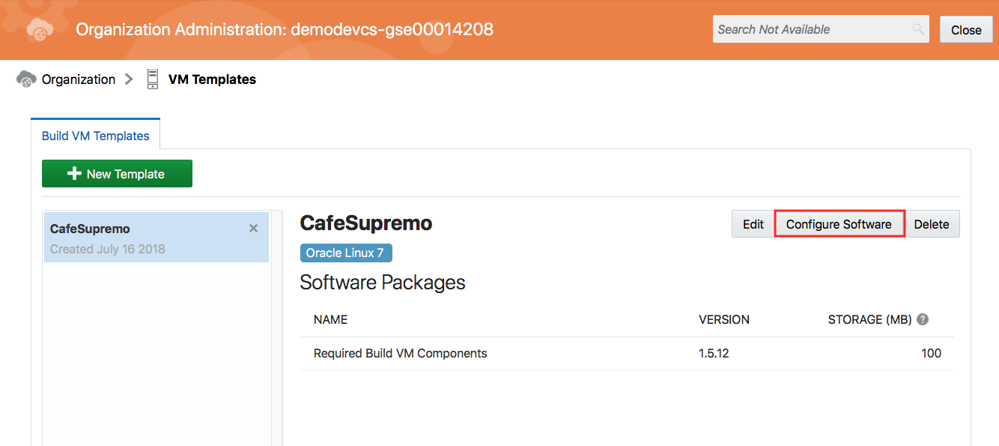

  - Select **Gradle 4** and **Node.js 6** from the list of software by clicking the **Add** `+` icon on that tile.

  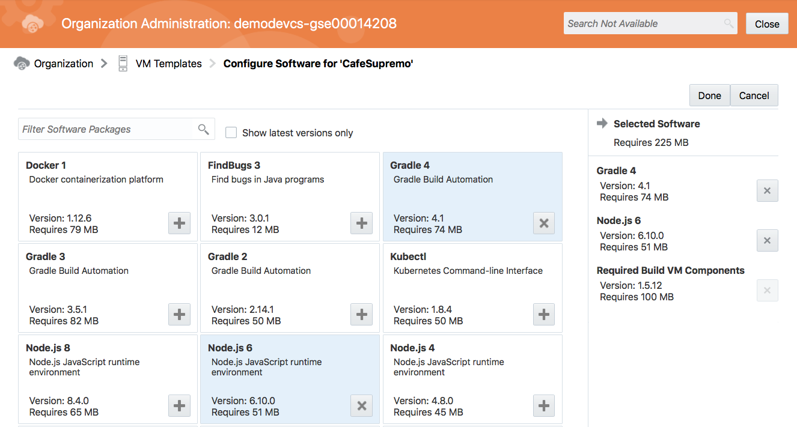

  - Click on **Done** to save the selections

    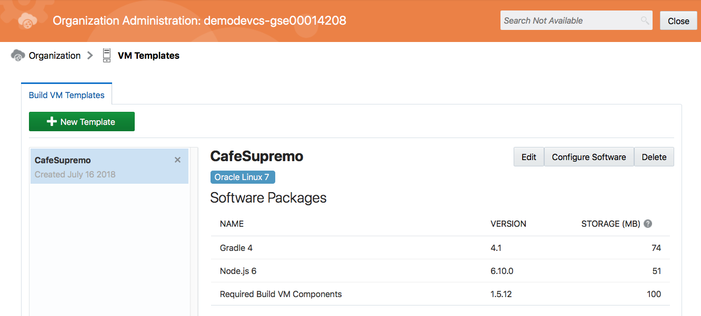

### **STEP 6.3**: Create a Virtual Machine for Build and Develop

Oracle Developer Cloud Service projects use Oracle Cloud Infrastructure Compute Classic virtual machines (VMs) to run builds. To use the VM we need to connect the VM with Oracle Developer Cloud Service and we need to capture some service detail about the VM for configuration.

- In another browser tab or window, open Oracle Cloud Dashboard

- In the **Compute Classic** tile, click the hamburger icon, and select **View Details**

  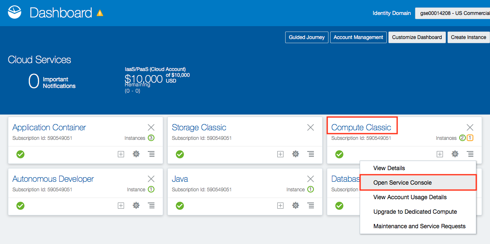

- On the Service Details page, in the Additional Information section of the Overview tab, note the values of **Service Instance ID** and **REST Endpoint**

  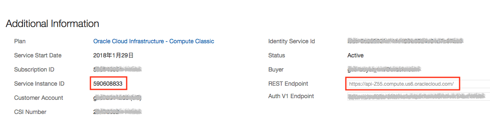

- Go back to the Developer Cloud Service Organization Administration Page

- Select **VIRTUAL MACHINES**

  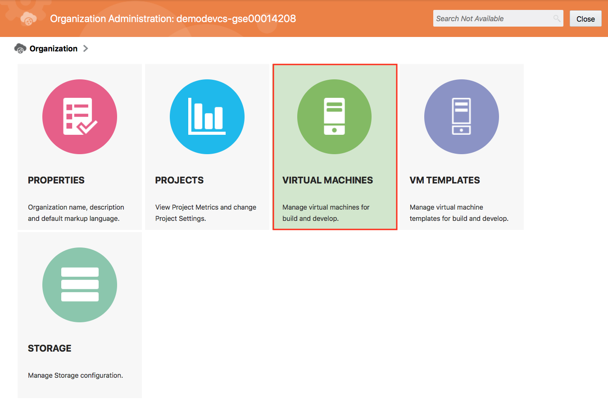

- On the Virtual Machine page, click **Configure Compute Account**

  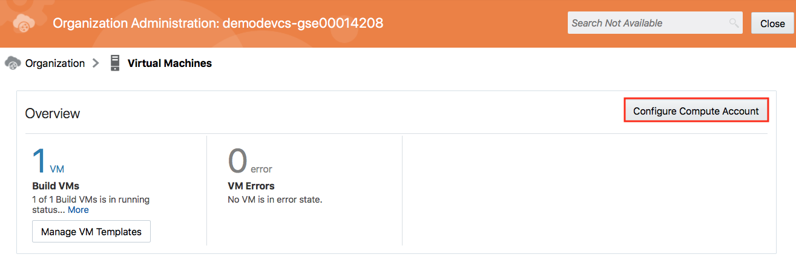

- In the Configure Compute Account dialog box, enter the following values:

  - **Username**: Your Cloud Username
  - **Password**: Your Cloud User Password
  - **Service Instance ID**: *ID assigned to the Oracle Cloud Infrastructure Compute Classic instance* (The value must match the Service Instance ID field that appears on the Oracle Cloud Infrastructure Compute Classic Service Details page.)
  - **REST Endpoint**: *REST API endpoint URL for the Oracle Cloud Infrastructure Compute Classic instance* (The value must match the REST Endpoint field that appears on the Oracle Cloud Infrastructure Compute Classic Service Details page.)

  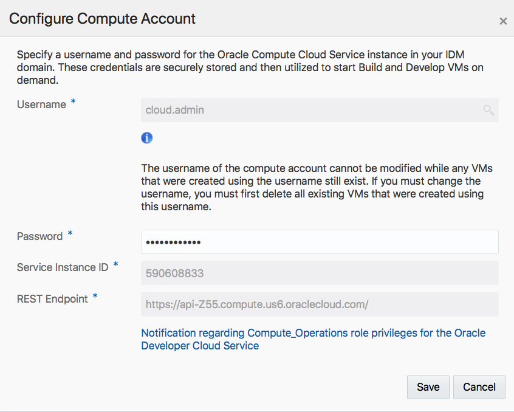

- Click on **Save**

You have now created a Build VM for for your build jobs. The initial status will be in the STOPPED state.

  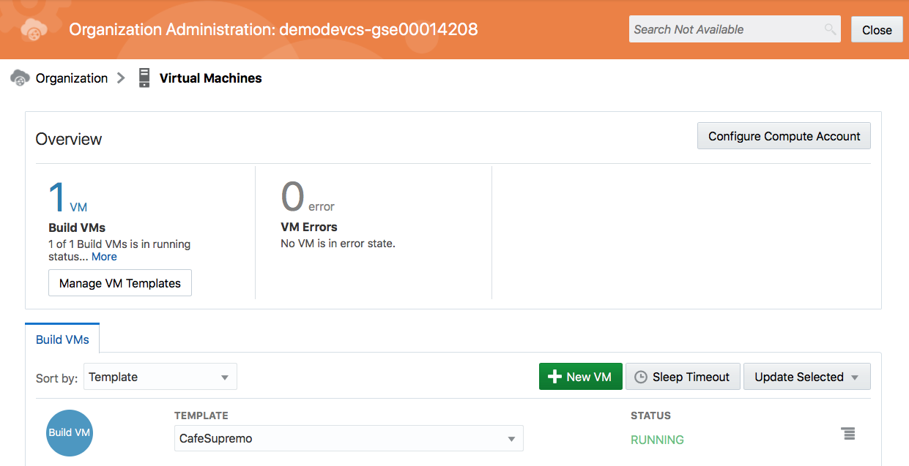

You have finished this lab section.

[Proceed to Lab 200: Create CI/CD Pipeline in DevCS](200-DEVCSlab.md)

or

[Return to Cafe Supremo Home](README.md)
