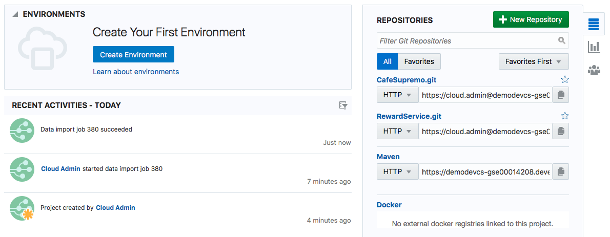
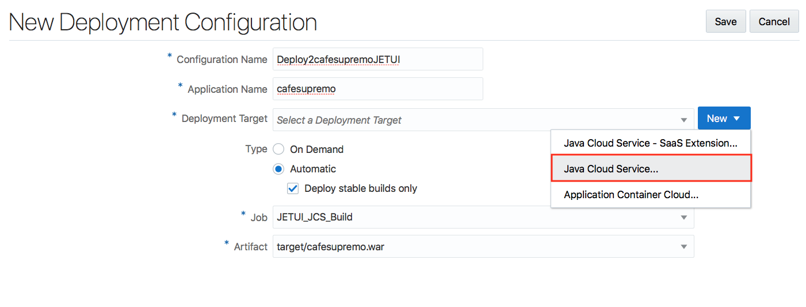
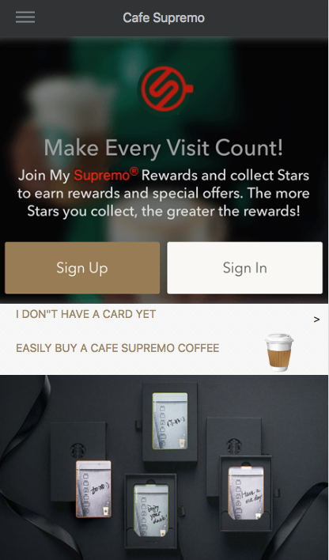

# Lab 200: Create Continuous Integration and Continuous Delivery Pipeline in Developer Cloud Service


We will create a project for the Café Supremo in Developer Cloud Service and bring all the components into this project so that we can automate the build and deploy process. We will also examine other chain tools that comes with DevCS such as branch merge request, issue tracking, Agile development, release management and team collaboration.

### About This Exercise

In this exercise, we will:

- Create and configure a Developer Cloud Service (DevCS) Project
- Configure storage for uploading project archives
- Import project data
- Create and configure build jobs and deploy configurations
- Deploy the JET UI frontend to JCS
- Deploy the Node.js Reward Service to ACCS
- Explore Issue Tracking, Agile development, Release Management and Source Code Management


## Create a Developer Cloud Project and Configure CI/CD Pipeline


### **STEP 1**: Create a DevCS Project

- Go back to the Developer Cloud Service Console

- Create a new project by clicking **New Project**

- Enter `CafeSupremo` in the **Name** field

- Click **Next**

  

- Select an **Empty Project** for now and we will upload the Git repositories later from a project archive

  

- Click **Next** and followed by **Finish**

  Project creation will start upon selecting Finish.

**NOTE**: The project creation will take approximately 2 minutes to complete.


### **STEP 2**: Setup The Storage For Importing a Project Archive

You should have an empty project after the project creation completes. We now need to populate the project with data such as source code and build configurations. A previously configured CafeSupremo project was exported as an archive. This contains the Git repositories for the source code, mock issues and agile boards to illustrate a working project. We will now import this archive and configure the build pipelines.

Before you can upload the project archive, you must first configure a storage to upload the project archive to. This is a storage that can be accessed by the Developer Cloud Service.

**NOTE :** You can download the project archive from here.


- In another browser tab or window, open Oracle Cloud Dashboard

- On the dashboard click the hamburger icon on the **Storage Classic** tile, and select **View Details**

  

- On the Service Details page, in the Additional Information section of the Overview tab, note the value of **REST Endpoint** and **Auth V1 Endpoint**. These will be required in the following steps.

  

- Go back to the Developer Cloud Service Organization Administration Page

- Select **STORAGE**

  

- Click **Create**

- Enter the following on the Edit Storage Configuration popup:

  - **Service ID**: This is made up of `Storage-<domain ID>`. Just type *Storage-* and append your *domain ID* to the end.
  - **Username**: Your Cloud username
  - **Password**: Your Cloud user password
  - **Authorization URL**: You found this in the previous step on the Storage Classic View Details page


  


- Click on **Update** to save the configuration

- Click on **Test Connection** to validate connectivity to your storage and you should get a **Connection successful** in response

  


- Click on the left angle arrow **<** on the top left hand corner of the Organization Administration page to return to the project home page


### **STEP 3**: Uploading The Project Archive To The Storage

You can import project data from the Oracle Cloud Infrastructure Object Storage Classic container into the Oracle Developer Cloud Service project. Hence we need to upload our project archive to an Object Storage Classic container. To do we must first create a container in Object Storage and upload the project archive there.

- On the dashboard click the hamburger icon on the **Storage Classic** tile. Select **Open Service Console**.

  

- Click **Create Container** to create a storage area for uploading your project archive to

  

- Enter `tmp` as the **name** for your container and click **Create**

  

- Your newly created container **tmp** should appear in the *Container List*

- Click on **tmp**

- Click **Upload Objects**

  

- Select your archive file and upload

  If you have not downloaded the project archived, you can download it from [here].

The project archive is now ready to be imported into the CafeSupremo project.


### **STEP 4**: Importing a Project Archive

When you import data from Oracle Cloud Infrastructure Object Storage Classic, it overwrites all the data in the project. All issues, Git repositories, and wiki pages of the project are replaced with the components of the imported project.

To import project data from Oracle Cloud Infrastructure Object Storage Classic into Oracle Developer Cloud Service:

- Move over to the navigation bar on the left and click the **Administration** icon

- Select **Data Export/Import** from the popup context option list or from the Administration page

  

- Complete the Data Export/Import Page as illustrated below using the REST Endpoint URL you obtained in Step 2


  

   You would need to extrapolate from the REST Endpoint URL and break it down into separate elements uses the following syntax: <storage_service_url>/v1/<storage_service_name>-<identity_domain>

  For example, if the REST Endpoint URL of your service is https://gse00002222.storage.oraclecloud.com/v1/Storage-gse00002222, then enter the following value:

  - **Storage Service URL**: `https://gse00002222.storage.oraclecloud.com`
  - **Storage Service Name**: `Storage`
  - **Identity Domain**: `gse00002222`
  - **Storage Account Username**: Your Cloud username
  - **Storage Account Password**: Your Cloud user password

- Click on **Connect**

- Once connected, the page will expand with the **Create Job** configuration. Complete the elements with the following:

  

  - **Type**: `Import`
  - **Storage Container**: `tmp`
  - **Storage Object**: Select the archive file your uploaded to the Object Storage Container

- Click **Import**

- Check the *Import project data into 'CafeSupremo'* and Click **Yes**

  


**NOTE:** The project archive import will begin and will take about 10 minutes to complete

- Once completed, you will be presented with two Git repositories:

  - **CafeSupremo.git** that holds the JET UI frontend code
  - **RewardService.git** that holds the Node.js microservice code

  

- Verify the rest of the project has been imported properly by navigating into different tools on the navigation bar.

  There should be issues, agile boards, and code. However, there are no project members, build jobs or deployment configuration as these cannot be exported with the original project. Therefore we would need to rebuild these configurations in the following steps.


### **STEP 5**: Add New Members To The Project

Project members are not exported with the orignal project. These members are referenced in the issues tracking and agile tool. Hence we will need to add these users back into the project.

- Go to the project home page

- Click on the **Team** icon to see the project members

  There should only one member in the team and that is the owner of the project **cloud.admin**

  

- Click on **New Member**

- Select all the users from the available user list and click **Add**

  

- Your now have all the users required for the demo

  


## Create The Build Pipelines

Now that we have imported the project archive for our demo, we can start creating our CI/CD pipelines for the JETUI frontend and the RewardSerivce microservice. This includes creating the build job configurations and the deployment configurations.


### **STEP 6**: Create The JETUI Frontend Build Job

The first task in our CI/CD pipeline is to build the JETUI frontend application. We need to create a build job for this. And we want the build to be triggered automatically whenever there is a code commit. The build process can be automated and deployed automatically to a designated JCS environment.

- Switch to Build tab on the navigation bar. There should be no build job initially.

- Click on **New Job**

  

- Complete the fields with:

  - **Job Name**: `JETUI_JCS_Build`
  - **Software Template**: `CafeSupremo` this is the Build Template you create in Lab 101

- Click **Create Job**

  

- Now you will be presented with the Job Configuration page

- Configure the build job by specifying the Git repo to build from. On the *Source Control* tab click on **Add Source Control**

  

- Select `CafeSupremo.git` from the dropdown box for **Repository** and check the **Automatically perform build on SCM commit** option to enable automated build upon a code commit.

  

- On the *Builders* tab click on **Add Builder** button and select **Unix Shell Builder** from the context option list

  

- Copy and paste the npm install script into the command field. Basically the script is building a web module from the JET UI code and then create a WAR file for deployment.

  ```
  npm install
  grunt build:release
  cd web
  mkdir WEB-INF
  cp ../JCS/web.xml WEB-INF/web.xml
  zip -r ../target/cafesupremo.war *
  ```

  

- On the *Post Build* tab click on **Add Post Build Action** button and select **Artifact Archiver** from the context option list

  

- Enter `target/cafesupremo.war` in the **Files to archive** field to define the location of the build output which it will be used for deployment

  

- Click **Save** to save the configuration

- Click **Build Now** to test the build job configuration by running it

- The build should complete without any error

  

Congratulation! You have now completed your first build.


### **STEP 7**: Create The Reward Service Node.js Build Job


- Switch back to the Build tab and create a new job. There should be only be one job and that is the *JETUI_JCS_Build* you just created.

- Click on **New Job**

- Complete the fields with:

  - **Job Name**: `RewardService_Build`
  - **Software Template**: `CafeSupremo` this is the Build Template you create in Lab 101

- Click **Create Job**

- Configure the build job by specifying the Git repo to build from. On the **Source Control** tab click on **Add Source Control**

- Select `RewardService.git` from the dropdown box for **Repository** and check the **Automatically perform build on SCM commit** option to enable automated build upon a code commit.

  

- On the *Builders* tab click on **Add Builder** and select **Unix Shell Builder** from the context option list

- Copy and paste the npm install script into the command field. The script also archive the build into a zip file for deployment to ACCS.

  ```
  npm install
  zip -r rewardservice.zip *
  ```

  

- On the **Post Build** tab click on **Add Post Build Action** button and select **Artifact Archiver** from the context option list

- Enter `*` in the **Files to archive** field to define the location of the build output which it will be used for deployment.

  

- Click **Save** to save the configuration

- Click **Build Now** to test the build job configuration by running it

- The build should complete without any error

  

  You have now completed the **RewardService_Build** build job


### **STEP 8**: Create The JET UI Frontend Deployment Configuration

The next part of the CI/CD pipeline is the deployment of the builds. Let's create a deployment configuration for the JET UI frontend. The deployment runtime is the JCS environment which you provisioned earlier.

- Go to the **Deploy** page

- Click on **New Configuration**

  

- Complete the New Create New Configuration as illustrated below:

  - **Configuration Name**: `Deploy2cafesupremoJETUI`
  - **Application Name**: `cafesupremo`
  - **Type**: `Automatic` and check `Deploy stable builds only`
  - **Job**: `JETUI_JCS_Build`
  - **Artifact**: `target/cafesupremo.war`

- Click **New**

- Select the **Java Cloud Service** from the context option list

  

- Complete the **Deploy to Java Cloud Service** popup configuration as illustrated below:

  - **Version**: `Oracle Weblogic Server 12c (12.2.x or higher)`
  - **Protocol**: `Oracle Weblogic RESTFul Management Interface`
  - **Host**: The IP address for your JCS environment
  - **HTTPS Port**: `7002`
  - **Username**: `weblogic`
  - **Password**: You weblogic password

- Click on **Find Targets**

  

- This will return one or more intended targets

- Check the **demoJCS_cluster**

- Click **OK**

  

- You should see the **Deployment Target** field completed with your JCS environment

- Click on **Save**

  

- You have now completed the deployment configuration for the JETUI Frontend. Let's try deploying a build to JCS cluster.

- Select the **Redeploy** option from the Settings dropdown options.

  

- Select the latest build from the **Build** dropdown list

- Click **Deploy**

  

- The deployment should complete successfully with a *Last deployment succeeded* message as below

  

- Verify your deployment by going to the JET UI frontend URL

  Enter `http:<JCS IP address>/cafesupremo` in your browser, replacing the `<JCS IP address>` with the external IP address of your JCS instnace.

  

Congratulation if you can load the Cafe Supremo home page.

- Explore the JET UI by selecting the menu options from the hamburger icon at the top left hand corner of the Cafe Supremo home page


### **STEP 9**: Create The Reward Service Deployment Configuration

Now we create a deployment configuration for the Node.js Reward Service backend. The deployment runtime is the ACCS environment which you provisioned earlier.

- Go to the **Deploy** page

- Click on **New Configuration**

- Complete the New Create New Configuration as illustrated below:

  - **Configuration Name**: `Deploy2rewardserviceNODE`
  - **Application Name**: `rewardservice`
  - **Type**: `Automatic`
  - **Job**: `RewardService_Build`
  - **Artifact**: `rewardservice.zip`

- Click **New**

- Select the **Application Container Cloud...** from the context option list

  

- Complete the **Deploy to Application Container Cloud** popup configuration as illustrated below:

  - **Data Center**: `US Commercial2 - us2`
  - **Identity Domain**: Your domain ID
  - **Username**: Your Cloud username
  - **Password**: Your Cloud user password

- Click **Test Connection**

  

- This will return successfully only if all the parameters are entered correctly

  

- Check **Use Connection**

- Check **Node** in the **ACCS Properties** list

- Click **Save** to save the configuration

  


You have now completed the deployment configuration for the RewardService. Let's try deploying a build to ACCS instance.


- Select the **Redeploy** option from the Settings dropdown options.

  

- Select the latest build from the **Build** dropdown list

  

- Click **Deploy**

- The deployment should complete successfully with a *Last deployment succeeded* message as below

  

- Verify your deployment to see if you can retreive the current status for reward points and coupons

  - Enter `https://<rewardservice hostname>/loyalty/v2/points/10001` in your browser substituting the hostname of the URL with the **rewardservice** instance URL's hostname you obtained in Step 4 from the previous Lab 101

    If successful, you should see a return text of `{"points":0}` indicating zero reward points

  - Enter `https://<rewardservice hostname>/loyalty/v2/coupon/10001` in your browser substituting the hostname of the URL with the **rewardservice** instance URL's hostname you obtained in Step 4 from the previous Lab 101

    If successful, you should see a return text of `{"coupon":0}` indicating zero coupons


You have finished this lab section.

[Proceed to Lab 300: Putting It All Together - CICD](300-CICDlab.md)

or

[Back to Cafe Supremo Home](README.md)
