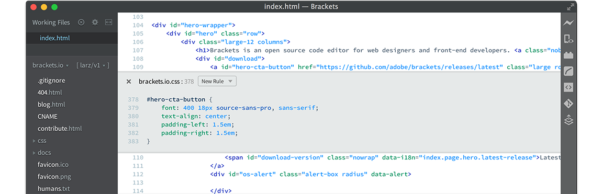

## Installation of Brackets ##

Brackets is a modern text editor that makes it easy to design in the browser with focused visual tools and preprocessor support. It's crafted from the ground up for web designers and front-end developers. Brackets is an open-source project, supported by an active and passionate community. For detail, you can go to [Brackets.io](http://brackets.io/)

### Prerequisites ###
This lab guide assumes the following:
- Internet access available (to download installer or copy from instructor)

#### Installation of Brackets ####

1. Go to [Brackets Home Page](http://brackets.io/) and click `Download Brackets 1.10` button at the middle.

2. This guideline assumes **Microsoft Windows hosts** as example, but it should be similar on other OS.  
Select to save the installer executable on your harddisk destination.

3. On your harddisk diretory where `Brackets.Release.1.10.msi` is saved, open to execute the installer.  
Select your target Brackets Destination Folder, and then click `Next` button.

4. Click `Install` button to proceed the installation.

5. The Brackets installation should be done in a minute, click `Finish` button to finish installation.

6. From the Brackets installed location or *Search Windows* (on Win10), run the `Brackets.exe`.

7. The Brackets should be started like below.

8. At the upper right corner, click on the `Extension Manager` icon.

9. Enter `git` in the search area, then scroll to locate `Brackets Git` and click `Install` button on the right.

10. Simply click `Save` to accept default **Git Settings...**.

11. Click `OK` button to proceed restart, and the Brackets should be restarted by itself.

11. On restart done, click `Close` button to close the **ChangeLog** diaglog window.

12. You have successfully installed Brackets with Git exchange capability.

[Back to CI/CD Hands On Lab](CICDlab.md)

or

[Back to Cafe Supremo Home](README.md)
