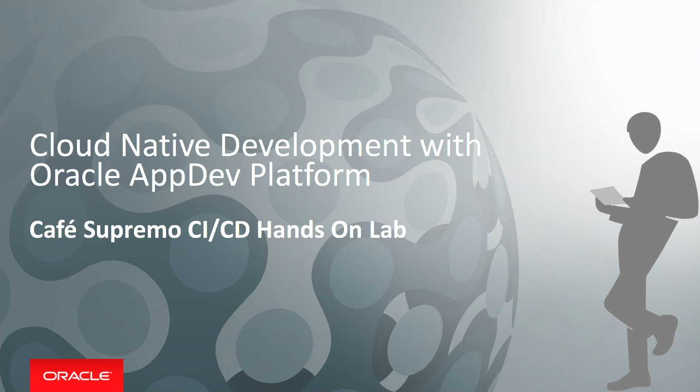

# Cafe Supremo CI/CD Hands On Lab

## Introduction

This workshop will walk you through the process of moving an existing application into a CI/CD pipeline and deploying it to a WebLogic cluster and a ACCS Node.js instance in the Oracle Public Cloud.

You will take on 2 personas during the workshop. The **Lead Developer Persona** will be responsible for configuring the parts of the automated build and deploy process that involve details about the application itself. The **DevOps Engineer Persona** will configure the parts of the automation involving the JCS and ACCS infrastructure. To automate the building and deploying of this application you will make use of Developer Cloud Service for CI/CD, JCS for hosting JET UI frontend, and ACCS for hosting the Rewards Service.

**NOTE**: Please follow the lab exercises below for demo set up.

# Lab Exercises

There are three parts to the lab with each focusing on different aspect of Cloud Native Application development, from provisioning of a cloud environment to importing your code and creating you CI/CD pipeline. Please begin your exercise in the following order:

## 100: Prepare Your Oracle Cloud Environments

[Click Here to Lab 100: Prepare Your Oracle Cloud Environments](100-PREPARElab.md)

## 102: Create Continuous Integration and Continuous Devlivery Pipeline in Oracle Developer Cloud Service

[Click Here to Lab 200: Create CI/CD Pipeline in DevCS](200-DEVCSlab.md)

## 103: Putting It All Together - Continuous Integration and Delivery

[Click Here to Lab 300: Putting It All Together - CICD](300-CICDlab.md)

[Return to Cafe Supremo Home](README.md)
