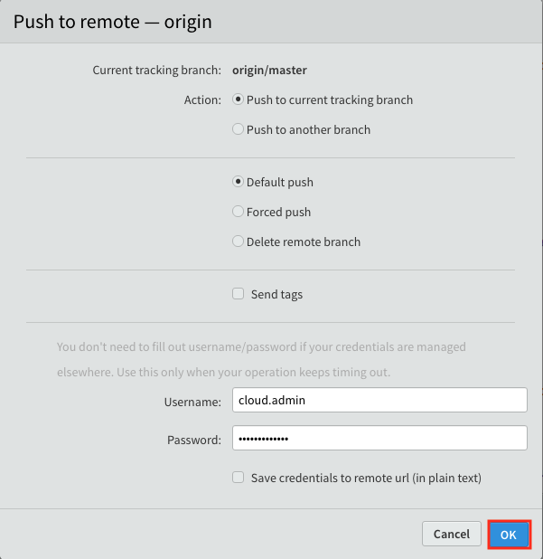
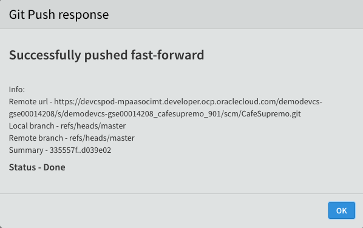
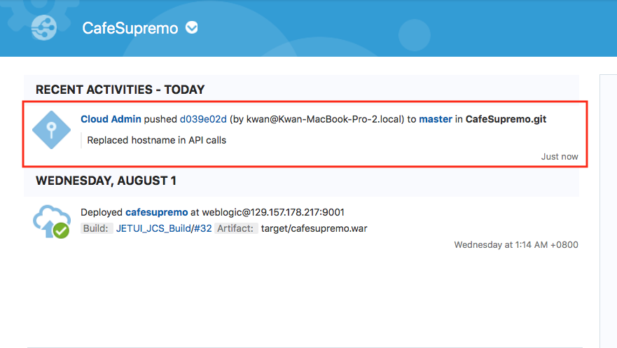
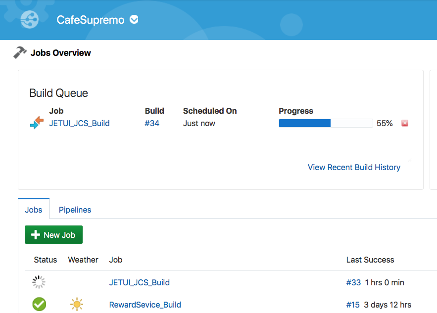
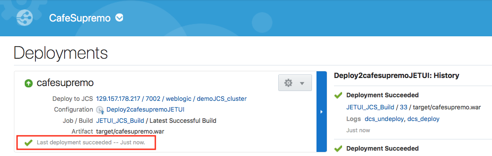
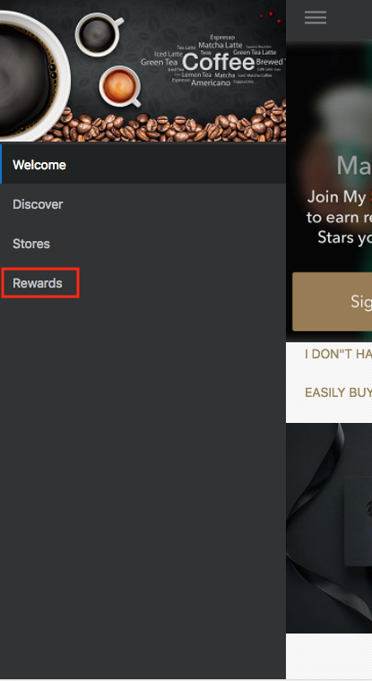
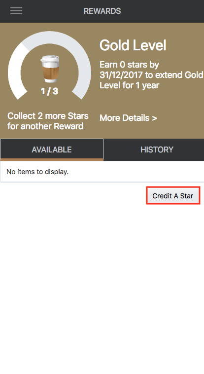
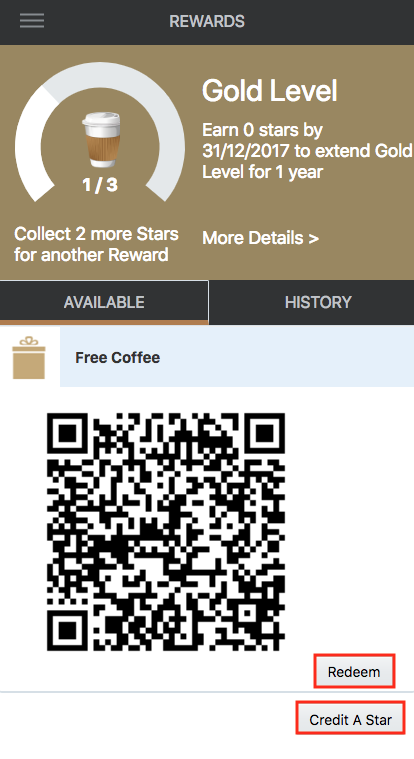

# CI/CD Demo - Café Supremo Microservices

This repository contains the demo script to demonstrate a typical DevOps workflow of a cloud native application using Oracle AppDev Platform. This includes services such as Oracle Developer Cloud Service, Java Cloud Service, Application Container Cloud Service and Database Cloud Service.

This demo will also show how to work with Open Source tools in Oracle Developer Cloud Service for managing your software lifecycle as well as how to build, deploy and promote to different environments. With Continuous Integration and Delivery as core principles, this demo will illustrate how issues are tracked, managed and how to manage releases.

This repository includes the instruction and pipeline definition for continuous delivery using Developer Cloud Service. On every pipeline execution, the code goes through the following steps:

This demo showcases the following:

*	Continuous Integration and Continuous Delivery through automation in Oracle Developer Cloud Service
*	Task creation using Oracle Developer Cloud Service Issue tracking system
*	Working with Open Source tools
*	Pushing the changes from a remote repository
*	Scaling up and scaling out of ACCS and JCS

# Time to Complete

Approximately 30 minutes

# Background

Oracle Developer Cloud Service is a cloud-based hosting environment for software development projects. It is available as a web interface accessible from a web browser. Oracle Developer Cloud Service provides the following features and services:

*	Project creation, configuration, and user management
*	Agile development
*	Integrated issue tracking for tasks, bugs, and enhancements
*	Source code repository through Git to store your application source
*	Maven repositories to store your application dependencies and libraries
*	Code Review enabled with Team Collaboration
*	Continuous software build integration
*	Wiki collaboration
*	Deployment to an Oracle Java Cloud Service and Application Container Cloud Service

# Scenario

You are an application developer who will be developing a brand new cloud native loyalty application for Café Supremo, which will be deployed to the Oracle Cloud. The reason why you want to adopt a cloud native approach has partially been driven by the need to go to market quicker, by delivering new features more frequently, but also more reliably. And you are able to do this by developing Microservices that has less dependencies on other services, as well as the footprint being smaller and easier to deploy. What’s also attractive with Microservices is that you can use the best programming language for the job. So, you could end up with a polyglot application. To be able to deliver this new style of cloud native application approach, you will need to adopt the Agile development practice to continuously integrate and deliver these services and features. The application basically consists of two parts:

1. The user interface that is built using Oracle JET framework, packaged as a WAR file and deployed to a Java Cloud Service instance
2. The Reward Collection backend service, which is a Microservice written in node.js, packaged as a ZIP file and deployed to an Application Container Cloud Service instance

You will use DevCS as the core CI/CD software lifecycle management tool for your Agile development and DevOps pipeline. The Café Supremo project has already been created and populated with both the JET UI and the Reward Service. The latest JET UI is also deployed to a previously provisioned JCS instance and the Reward Collection is deployed to a previously provisioned ACCS instance. The customer data has also been uploaded to a DBCS instance.
This demo assumes that you will be logging into an Oracle Developer Cloud Service instance that is populated with the Café Supremo project. This demo also requires a desktop environment with Brackets installed.

A project manager will be logging in to an Oracle Developer Cloud Service and manage the Café Supremo project from issue tracking to tracking the build, deploy and release progress.

# What Do You Need?

*	Access to an Oracle Developer Cloud Service instance
*	Access to an Oracle Application Cloud Service instance
*	Access to an Oracle Java Cloud Service instance
*	Access to a mobile phone
*	One of the following supported browsers:
    *	Firefox 31 or above
    *	Chrome 37 (also for Android)
    *	Safari 7, 8 or 9
    *	Safari Mobile 5 (iOS)
*	An installation of Brackets with Bracket Git by Martin Zagora extension installed
*	An installation to mirror your mobile screen to the projector
*	Some familiarity with Oracle Java Cloud Service
*	Some familiarity with Oracle Application Cloud Service
*	Some familiarity with Brackets
*	Some familiarity with the Git source control system
*	Some familiarity with Hudson Continuous Integration system

# Iteration 1:   Introducing the Café Supremo Loyalty Application and Oracle Cloud

You are an application developer who will be developing a brand new cloud native loyalty application for Café Supremo, which will be deployed to the Oracle Cloud.

## Step 1: Introduce The Application

* With reference to the architecture diagram above, describe the application. The application basically consists of two parts:

  - The user interface that is built using Oracle JET framework, packaged as a WAR file and deployed to a Java Cloud Service instance
  - The Reward Service is a Microservice written in Node.js, packaged as a ZIP file and deployed to an Application Container Cloud Service instance with a ACCS Cache to cache customer data

* The application flows like this:

  - A customer logs into the Cafe Supremo JET UI frontend on her mobile phone to check her rewards account
  - This makes a REST API call to the Node.js Rewards Service on the ACCS instance
  - The Reward Service looks up the customer database for the customer details and cache it in the ACCS Cache
  - Returns the rewards detail back to JET UI frontend

* The JET UI and the Reward Service are being developed in parallel independent of each other, by two different teams:

  - The JET UI frontend is developed in JET, basically Java Script
  - The Reward Service microservice is developed in Node.js
  - The source code are stored in separate Git repositories to provide isolation and built differently

* Show the Cafe Supremo JET UI frontend to the audience

  

* Either mirror your mobile phone on screen or open your browser in the Developer Tools mode to simulate a Mobile Device
* Enter Café Supremo URL - `http://<JCS IP address>/cafesupremo` in your browser
* Click on the hamburger icon at the top left hand corner of the Cafe Supremo home page

## Step 2: Explore The Application

* Show how the JET UI frontend looks like by going into the **Discover** and **Stores** options to discover the coffees on sale at store and locations of the stores
* Highlight the  **Rewards** option has not been completed and hence it is greyed out. This is the option to credit and redeem your coffee rewards.
* When the **Rewards** option is availble and selected, it makes a REST API call to the Rewards Service
* Since the Rewards Serivce is developed by a different team, this microservice will be integrated once ready
* We will show how you can improve your team’s productivity and quickly rollout new services by adopting CI/CD in Oracle AppDev Platform

  
  

## Step 3: Introduce Developer Cloud Service

Think of yourself as the project manager for the Café Supremo Reward application. And you need to bring your JET UI frontend application into our cloud environment. You can do this by bringing your development under the control of Developer Cloud. With the Developer Cloud, you can implement CI/CD and practice the Agile methodology.

* Log into Developer Cloud
* On the Welcome page, you may see a list of projects hosted in the DevCS and one of the project is the CafeSupremo

  

* Click on **CafeSupremo** to enter the project

* You now in the **CafeSUpremo** project home

  
  
1. All your recent activities are logged here, things such as code commits, builds and deployments
2. If there are any running activities it will be show at the top
3. On the right is our Git repositories and you can see we have two separate repositories; **CafeSupremo.git** and **RewardService.git**
  
* Click on the **TEAM** icon on the right

  
  
1. The **TEAM** icon switches to the TEAM organisation pane
2. Here you can see all the memebers of your team and you can add new member to this team/project by clicking **New Member**

* Expand the nagvigation pane on the left and describe the available tools in DevCS

  

* Select **Code** from the navigation pane

* Highlight that you can switch between repositories by selecting the repo from the dropdown menu

  

* You can also look at the history of changes in graphical form

  
  
1. Click on **Logs** option
2. Click on **History** in Graph view
3. Scroll down the graph to show branches and merge requests

## Step 4: Explore The Build Jobs

To build the application we have two build jobs, one for the JET UI frontend and one for the Reward Service. Each build job is configured to pull soruce from different Git repositories and built for a different runtime platform.

* Switch to **Build** tab from the navigation panel

* There are two build jobs **JETUI_JCS_Build** and **RewardService_Build**

  

* Click on **JETUI_JCS_Build** to examine the job details

  

* You can see the build history, whether they've been successful or not and the duration of each build

* Click **Configure** to see the *Job Configuration*

* Under the **Source Control** tab we have specified `CafeSupremo.git` as the repository to use for the build

  
  
  * You can see multiple configuration tabs across the top of the Job Configuration page

* Under the **Builders** tab I have configured a **Unix Shell Builder** using *npm install*, *grunt* to build and *zip* to package the build into a *war* file

  
  
  * You can specify other Builders by selecting a build from the **Add Builder** option list such as *Maven* or *Node.js*

  
  
* Under the **Post Build** tab, I have specified the location of the build output war file to be used for deployment

  
  
* Now click on the **Gears** icon on the left hand side and go to the **Triggers** tab

  
  
  * This is where I have set the trigger to base on *Source Code Management Polling*
  * The trigger is set to monitor code commits every minute and if there are any code changes that has been committed to the Git repository, then this build job will start automatically
  * Hence we have automated the build part of our CI/CD pipeline

* Click **Cancel** to exit the *Job Configuration* page
  
* Go back to the **Build** page and click on **RewardService_Build** job

* Quickly go through the job configuration which is very similar to the **JETUI_JCS_Build**. So there is no need to spend too long on this.

## Step 5: Explore The Deployments

The next part of our CI/CD pipeline is the deployment configuration. There are two deployment configuration, one for the JET UI frontend and one for the Reward Service. Each deployment is configured to deploy to different runtime platform. The JET UI frontend will be deployed to a JCS instance and the Reward Service backend will be deployed to a ACCS instance.

* Switch to *Deploy* tab from the navigation panel

  

1. The deployment configurations will be listed on the left side of the page. Note the runtime information about deployment such as the cluster name, IP address of the JCS instance and the build job it is deploying to.
2. The deployment history for each deployment configuration will appear on the right hand side. This shows whether it is successful or not and you can access the logs for more information.

* Explore the **cafesupremo** deployment configuration by selecting **Edit Configuration** from the **Gear Wheel** icon

  

* This will open up the *Edit Configuration* page for **cafesupremo** which is the runtime configuration for our JEY UI frontend.

  

  - This deployment configuration takes the output from the **JETUI_JCS_Build** job
  - And defines the location of the artifact
  - An important setting here is the **Automatic** check box. This denotes that this deployment job will be triggered automatically if the previous step of the pipeline was executed successfully.
  - And it should deploy a stable build only
  
* Do the same for the **rewardservice** and open up the deployment configuration

  
  
  - The configuration is similar to **cafesupremo** but uses a ACCS runtime instead of JCS

# Iteration 2:   Introducing Continuous Integration and Continuous Delivery

## Step 6: Integrating The Reward Service

If you recall, the **Rewards** menu option on the CafeSupremo JET UI frontend was greyed out because the backend Reward Service microservice has not been completed. Assume the Reward Service is now ready to be integrated with JET UI frontend, I can integrate this by simply enabling the **Rewards** option. Let me show you how I can easily enable this by making a code change that would trigger an automated build in my CI/CD pipeline.

Let's put ourselves in the shoes of a developer. I can use my favourite IDE or a simple editor like Brackets with a Git plug-in. So that I can work with a clone Git repository locally on my laptop and sychronise my changes with the master Git repository in DevCS. I have set a flag in our JET UI code to disable the Reward Service initially. Let me show you where to make the code change.

* Open Brackets and go to the `CafeSupremo` folder

  

1. Locate `src -> js -> appControll.js`
2. Find line 46 and replace `true` with `false` for the Rewards option. This basically ungrey the Reward option.

* Select **Save** to save the code change

  
  
* Check the box next to Commit to select all modified files - this means the checkbox below (appController.js) will automatically be checked

  

* Click Commit to commit changes to the local cloned Git repository

* In the Git commit pop up enter the comment: `Enabled Rewards Service` and then click **OK**. This will commit the changes to your local git repository. Ignore any code inspection problems above.

  

* Click **Git Push** icon on the right side of the Git panel

  
  
* In the *Push to remote* pop up window, leave fields to their defaults and click **OK**. This will begin the Git push to the Developer Cloud *CafeSupremo.git* master repository.  

  
  
* Once Git Push completes, click **OK**
  
    
  
 
 
 ## Step 7: Observe Your CI/CD Pipeline
 
 - Switch back to your Developer Cloud Project home page and you should see your changes has been pushed to the DevCS master repository

  

- Click on the Build Job tab and you should see your changes has automatically triggered a build

- Follow the build as it moves from the build queue to running the build

  

- Follow your build status

  
  
1. Wait until the build completes
2. You can also follow the build progress by examining the console output by clicking on the **Console** icon on the right side of the build under the Action column

  
  
- Once the build completes successfully, click on the **Deploy Configuration** tab and wait till you see the *Last deployment succeeded* message in the **cafesupremo** configuration tile. Reload page if you don't see any updates.

  

- Let's verify your changes to see if the JET UI frontend is able to call the APIs in the Reward Service backend. Enter

  http:`<JCS IP address>`/cafesupremo in your browser replacing the `<JCS IP address>` with the IP address of your newly provisioned JCS instance
  
  Don't forget to open this in the Developer Tools mode for a Mobile Device
  
  
  
- Click on the hamburger icon on at the top left hand corner to expand the menu

  
  
- Click on **Rewards**

  
  
- Click on **Credit A Star** to see the counter increments

- Once you have accumulated 3 or more stars, you will be credited with a **Free Coffee** coupon

- Click on **Free Coffee** to reveal the QR code and a **Redeem** button

- Click **Redeem** to redeem coffee. This will reset the coupon counter.

  
  

## Step 8: Explore Release Management

In a real world scenario where you need to continuously integrate and deploy your application to a test environment, you also need to promote it to different environments such as test, UAT and production. You can automate the deployment to different environments in DevCS by creating multiple deployment configurations. However, if this is not desirable, you can also take an official release of a build offline to be deployed manually to different environments.

Developer Cloud Service supports release management throught the Release tool. We can create multiple releases, with each built from different code base or branches and with different dependencies.

* Explore the Releases feature, click on **Releases** option on the navigation panel on the left

  

* A release in DevCS is a collection of specific tags or branches of Git repositories, Maven repositories and binaries
* You can create a new release
* You can also download a release archive to be deployed manually on premise

## Step 9: Explore Agile Development

The Agile methodology of software development is a type of incremental model that focuses on process adaptability and customer satisfaction. In Oracle Developer Cloud Service, you use the Agile methodology to manage issues using Scrum and Kanban boards.

If you are new to Agile, see http://agilemethodology.org/ for more information.

From the Agile page, you can create or open a board. Use the filter views available to filter the board list, or use the Filter Boards search box to search for it. In the list, Kanban Kanban indicates a Kanban board and Scrum Scrum indicates a Scrum board.

* Explore Agile development, click on **Agile** option on the navigation panel on the left

* Walkthrough the **Backlog**

  

* Click on **Active Sprints** and walkthrough the active sprints. Demonstrate by dragging an issue from *To Do* to the *In Progress* column.

  

* Click on **Reports** and walkthrough the *Burndown Chart*, *Sprint Report*, etc.

  

Congratulation!! You have completed the demo.

[Return to Cafe Supremo Home](README.md)
