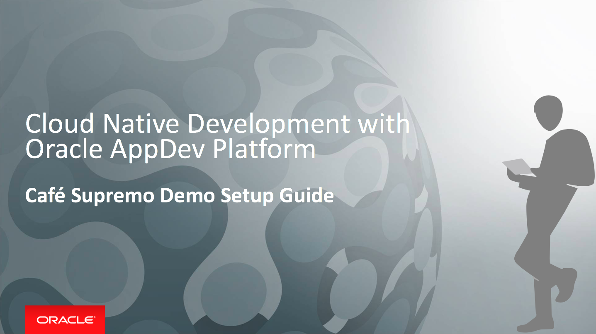

# Cafe Supremo Demo Setup Guide

This documentation contains the instruction to the demo setup. The steps are same as the [CICD Hands On Lab](CICDlab.md).

## Preparing Database Cloud Service, Java Cloud Service, Application Container Cloud Service and Developer Cloud Service

Before you can run the demo, you must provision the required cloud services for Developer Cloud Service to build and deploy to a WebLogic Server cluster in Java Cloud Service and an ACCS instance. You must have access to a:

- GitHub account
- Oracle Public Cloud Service account including Java, Application Container, Developer, Database and Storage Cloud Service

The current release of the application no longer requires a database for storing customer data. Customer data is now stored in a ACCS cache and is automatically populated upon the start up of the RewardService ACCS instance. This is to keep the demo setup duration short and to avoid the laborious effort in uploading the data to a database. However, a datbase would be required as a persistent storage in real case scenario.

Oracle Database Cloud Service is still required by Java Cloud Service to host only the Oracle Fusion Middleware component schemas used by Oracle Java Required Files (JRF).

The Demo Setup is the same as the Hands On Lab. Please follow the Hands On Lab for the setup.

[Follow CI/CD Hands On Lab for Demo Setup](CICDlab.md)

or

[Back to Cafe Supremo Home](README.md)
