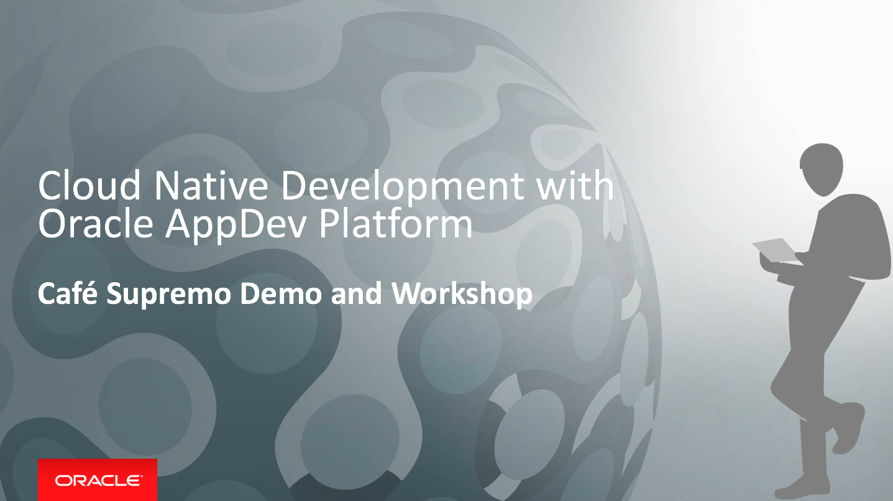
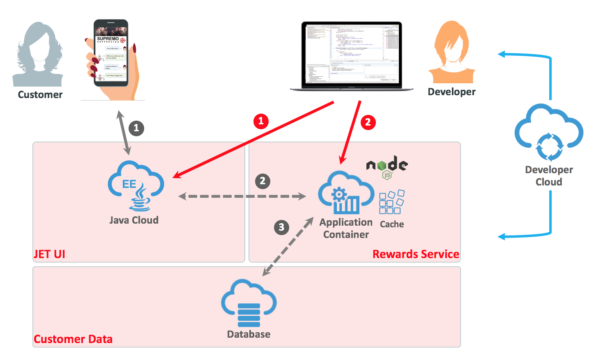

# Cloud Native Development with Oracle AppDev Platform - Café Supremo Demo and Workshop

## Introduction

This Oracle Cloud project contains the demo script and lab material to demonstrate a typical DevOps workflow of a cloud native application using Oracle AppDev Platform. Participants will be able appreciate and experience how to use Oracle Cloud Services to implement cloud native applications using a real use case scenario based on a loyalty rewards system for a coffe shop. This includes services such as Oracle Developer Cloud Service, Java Cloud Service, Application Container Cloud Service and Database Cloud Service.

The demo and lab will also show how to work with Open Source tools in Oracle Developer Cloud Service for managing your software lifecycle as well as how to build, deploy and promote to different environments. With Continuous Integration and Delivery as core principles, it will illustrate how issues are tracked, managed and released.

There are two parts to this project, a quick demo and a hands on lab. And you can select the path based on your target audience.

## Demo

The Demo is good for discovery workshops and meetings with C-level executives, architects and project leads. It takes about 30 minutes to complete. The demo comes in two parts, a guided script that walks through the demo steps and the setup procedure.

The [Demo Script](DEMOscript.md) showcases the following:

*	Continuous Integration and Continuous Delivery through automation in Oracle Developer Cloud Service
*	Task creation using Oracle Developer Cloud Service Issue tracking system
*	Working with Open Source tools
*	Pushing the changes from a remote repository
*	Scaling up and scaling out of ACCS and JCS

This requires a working demo that was previously configured. Please follow the [Demo Setup](DEMOsetup.md) instruction prior to running the demo. This will be the same instruction as the CICD Lab.

## CI/CD Hands On Lab

The CI/CD lab is good for deep dive workshops with architects, project leads and developers. This requires more time to and it takes about 3 hours to complete.

The [CI/CD Hands On Lab]CICDlab.md) provide a hands on experience in setting up the complete end-to-end CI/CD pipeline on Oracle Cloud Platform. This shows you how prepare a Developer Cloud Service for:

*	Project creation, configuration, and user management
*	Agile development
*	Integrated issue tracking for tasks, bugs, and enhancements
*	Source code repository through Git to store your application source
*	Code Review enabled with Team Collaboration
*	Continuous software build integration
*	Deployment to an Oracle Java Cloud Service and Application Container Cloud Service

## Scenario

You are an application developer who will be developing a brand new cloud native loyalty application for Café Supremo, which will be deployed to the Oracle Cloud. The reason why you want to adopt a cloud native approach has partially been driven by the need to go to market quicker, by delivering new features more frequently, but also more reliably. And you are able to do this by developing Microservices that has less dependencies on other services, as well as the footprint being smaller and easier to deploy. What’s also attractive with Microservices is that you can use the best programming language for the job. So, you could end up with a polyglot application. To be able to deliver this new style of cloud native application approach, you will need to adopt the Agile development practice to continuously integrate and deliver these services and features. The application basically consists of two parts:

1. The user interface that is built using Oracle JET framework, packaged as a WAR file and deployed to a Java Cloud Service instance.
2. The Reward Collection backend service, which is a Microservice written in Node.js, packaged as a ZIP file and deployed to an Application Container Cloud Service instance.
3. The customer data is stored in the Database Cloud Service and the data is cached in Application Container Cache.

You will use DevCS as the core CI/CD software lifecycle management tool for your Agile development and DevOps pipeline. A developer could use their favourite IDE or editor to write their code. In this scenario a developer will be using an open source editor called Brackets which can synchronise the code changes with the Git repository in Developer Cloud Service.

Different developers or teams can work independently on the JET UI frontend and the Node.js Rewards Service backend. The two parts can be integrated and delivered continuously through Oracle Developer Cloud Service.

A project manager will be logging into Developer Cloud Service and manage the Café Supremo project from issue tracking to tracking the build, deploy and release progress.

## Prerequisites ##

- The demo and lab requires an Oracle Public Cloud account
- You will also need to install a lightweight IDE - [Brackets](http://brackets.io/). Brackets installer will be provided by instructor or you can download it from [GitHub HERE](https://github.com/adobe/brackets/releases).  
- You need to have a Git Client. If you are already using Github Desktop, Eclipse or other IDE, you probably have Git already. Git installer will be provided by the instructor or you can download it from [here](https://git-scm.com/downloads).
- *[Click HERE for Brackets installation detail](BRACKETSinstall.md)*
- *[Click HERE for Git installation details](GITCLIENTinstall.md)*

[Go to Demo Setup](DEMOsetup.md)

or

[Go to CI/CD Hands On Lab](CICDlab.md)
