# 오라클 클라우드 테스트 드라이브 #

## 실습 2: 봇(Bot) 빌드 ##

### 소개 ###
챗봇과의 대화를 기반으로 하는 AI 를 디자인 할때, 다음 구성요소를 고려해야 합니다.

각 스킬은 이미 기존에 알고 있는 Bot의 역활을 수행합니다. 스킬은 각 업무를 위한 ChatBot 으로 개발되며,
Digital Assistant 는 복수 개의 업무를 수행 할 있도록 1개 이상의 스킬로 구성될 수 있습니다.

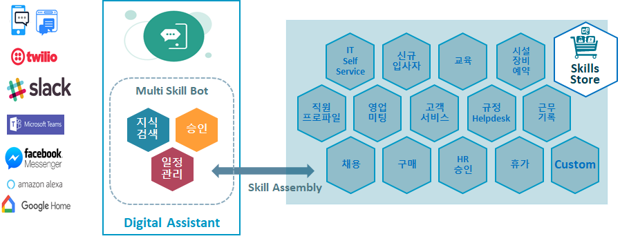

**Skill** 의 구성 요소
 - **Intent** 사용자가 봇(Bot)에게 질의한 목적을 의미 합니다. 예를 들어 은행 업무와 관련된 봇(Bot)에게 "나의 잔액이 얼마 입니까?" 라고 하면 현재 은행 계좌의 잔액을 알기 위해 질의를 한 것입니다. 

 - **Entities:** 사용자의 질의의 의도를 파악된 후 해당 기능을 수행 하기 위해 필요한 중요 정보를 포함되며, 사정의 입력한 다양한 표현안에 포함될 수 있습니다. "예를 들어 나의 계좌의 잔고는 얼마 입니까?" 라는 것은 나의 계좌 정보와 관련된 것입을 알 수 있습니다.
 
 - **Steps or States:** 대화 흐름을 구성하는 각각의 질문과 응답 입니다. 스텝들은 "컴포넌트"에 의해 구현 됩니다.
 
 - **Dialog Flow와 Decision Points:** 다이얼로그 플로우에서는 사용자의 질문, 사용자의 응답, Bot의 응답에 따라, 대화의 흐름을 다른 스텝으로 이동시킵니다.
 
 - **Variables:**  대화의 과정에서 일어나는 주요 정보를 저장하며 유지 합니다. 이를 통해 대화 흐름을 유지 할 수 있도록 합니다.

Oracle Digital Assistant는 적은 양의 코드로 고객이 웹 브라우저 상에서 2세대 챗봇을 개발 할 수 있는 지능형 봇 개발 툴 입니다. 이 툴은 고객이 새로운 `Skill`을 생성하고  `Intent`, `Entities`, `Dialog Flow`, `Custom Component`를 정의하며, Facebook 또는 Slack 과 같은 다른 외부 채널과 연결할 수 있는 설정을 제공합니다. 

Oracle Digital Assistant는 자연어 처리 테스트가 가능하며, 실시간으로 대화의 흐름의 변화를 테스트 할 수 있는 환경을 제공 합니다. 또한 개발자/운영자들이 사용자의 질의 목적에 대한 식별하는 Skill의 능력을 향상 시킬 수 있도록 하기 위한 튜닝을 제공하며, 이를 통해 사용자의 만족도를 향상 시킬 수 있도록 합니다. 이번 실습에서는 Oracle Digital Assistant 를 이용하여, Cafe Supremo Digital Assistant를 개발하고 사용자가 원하는 메뉴, Snack, Lunch를 주문 할 수 있도록 개발 할 예정입니다. 실습자는 카페에서 손님이 음식을 주문하는 것에 대한 새롭고 다양한 Intent와 Entities를 봇에게 가르치게 됩니다.

### 사전 준비 사항 ###
이번 실습에서는 Digital Assistant 개발을 조금 더 쉽고 빠르게 하기 위해, 미리 정의된 의도, 엔티티, 대화흐름 정의 정보를 임포트 할 것입니다. 참고로, 대화 흐름의 경우 오라클 봇 마크업 언어로 작성되어 있으며, 인텐트, 엔티티 경우 엑셀 파일로 작성되어 있습니다.
실습을 위해서 아래 링크에 위치해 있는 압축 파일을 다운로드 받으시기 바랍니다. 

 - [음식에 대한 대한 의도(Intents), 엔티티(Entities), 표현(Utterances)](Lab_Files/Intents-And-Entities.zip)
 - [음식 주문을 위한 오라클 머신러닝 다이얼로그 플로우](Lab_Files/DialogYAML.zip)

### Exercise Steps ###

아래 실습에서는 사전에 정의된 의도(intent)와, 엔티티, 대화흐름(Dialog Flow)을 구성하고, 학습 통해, Skill이 올바르게 동작하는지 테스트하겠습니다.

1. 강사가 공유 한 URL 에 접속하면, 아래와 같이 화면이 출력됩니다.

    
  
2. 왼쪽 상단에 햄버거 메뉴를 선택하고, `[Skill]` 메뉴를 선택합니다.

      

- `[New Skill]` 버튼을 선택합니다.
     
    

- 다음과 같이 생성 할 스킬 정보를 입력하고 `[Create]` 버튼을 클릭합니다.
  * Display Name : `Cafe_Supremo_TD_[YOUR INITIALS]` "[ ]"안에 본인의 이니셜을 넣습니다.
  * Name : 위와 동일
  * Version : 0.1

3.  **``[import Intents]``** 버튼을 선택하여  **GreetingIntents.csv** 을 임포트 합니다. (인사와 관련된 표현)

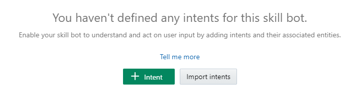

4. ``[More]`` 버튼을 선택하면 드롭 다운 메뉴가 펼쳐 집니다.

5. 위와 동일하게 **``“OrderFoodIntent.csv”``** 파일도 임포트 합니다.

6. 임포트된 intent 클릭하면, 포함되어 있는 있는 표현(utterance) 리스트를 볼 수 있습니다. 각각의 표현(utterance)의 목적은 의도(intent) 와 밀접하게 관련 있습니다.

7.  **(!)Train** 버튼을 선택하면, 각 인텐트(intent)에 표현(utternance)들을 학습하는데 필요한 NLP 엔진의 학습모델(Training Model) 을 선택 할 수 있습니다.

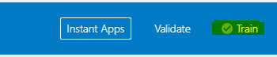

- 기본으로 선택되어 있는  **(Trainer Ht)** 을 선택하고, `[Submit]` 을 클릭합니다.

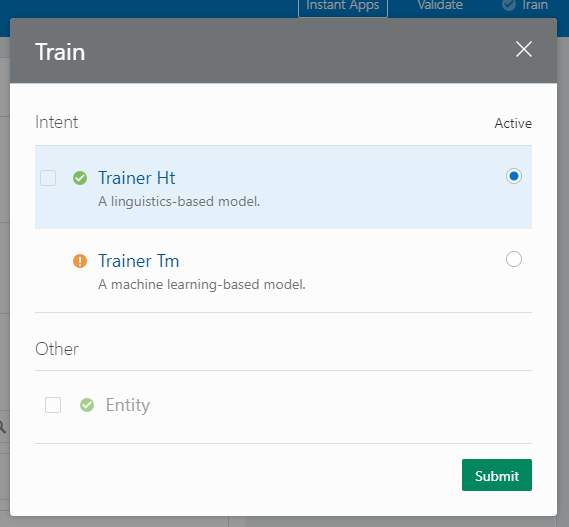

- NLP 학습이 성공적으로 되면, 아래와 같은 메시지를 확인 할 수 있습니다. 학습 성공 했다면, **[X]** 을 선택하 다이얼로그 창을 닫습니다.

**Note:** 위와 같은 다이얼로그 창은 일정 시간 후에 자동으로 닫히도록 되어 있습니다.

8. "Try out" 링크를 선택하면 봇을 테스터가 오른쪽 창이 나타납니다.

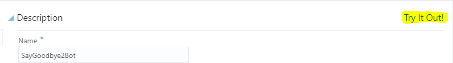

   아래와 같이 인텐트(intent) 탭을 선택합니다.

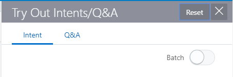

9. 테스터 아래 입력 창에 메시지를 입력하여, Skill 의 자연어 처리 엔진이 어떤 의도로 해석하는지 확인 합니다.

아래와 같이 입력 하거나, 유사한 표현을 사용하여 입력하여 테스트 해보세요.

- I’m really Hungry
- I’d like something for Lunch
- Good morning Mr Bot!
- I’d like a bite to eat
- bye bye!

아래와 같이 결과가 보이는지 확인해 보세요.

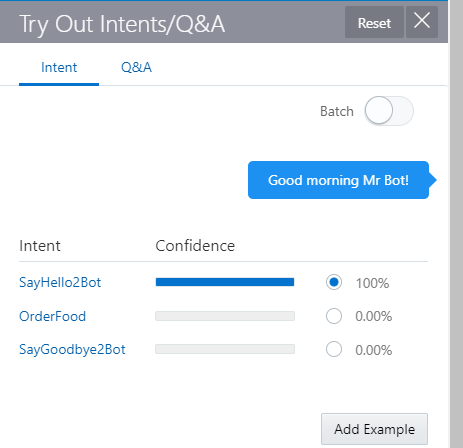 
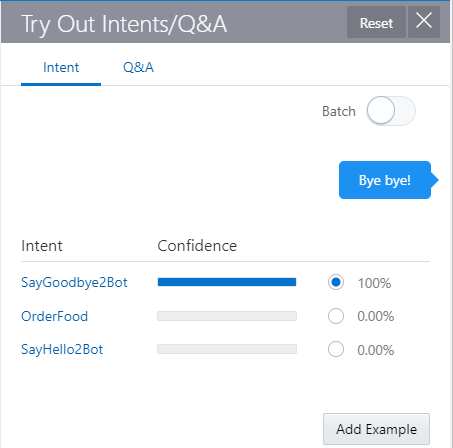 
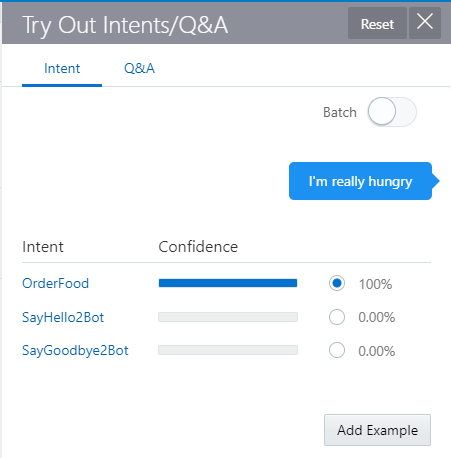

10. 다음 메시지를 입력하고, NLP 엔진이 어떤 intent 로 인식하는 확인 합니다.. 

- **"let's go for some real food"**

**NOTE:** 위 메시지의 경우, NLP 엔진은 정확하게 어떤 인텐트(intent)인지 알 수 없지만, 어떤 인텐트(intent)와 가까운지 보여줍니다. 

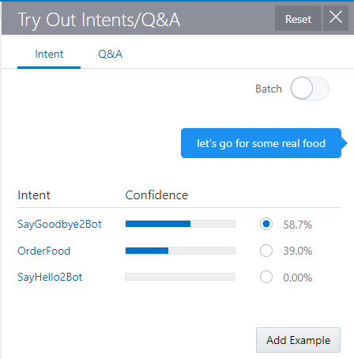

11. NLP 엔진에 추가 표현을 학습 시키는 방법은 아래와 같습니다. 
- 가장 가까운 **인텐트(intent)**의 Radio 버튼을 선택합니다. (위 메시지의 경우는 **"OrderFood"** 에 해당합니다. ) 
**``[Add Example]``** 버튼을 선택하면, **`OrderFood`** intent 리스트에 추가 됩니다.

- [Train] 버튼을 다시 선택합니다. 추가로 학습이 필요한 경우 [Train]버튼의 경우 **(!)** 가 표시 됩니다. 

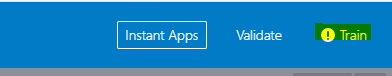

- 이전과 동일하게 **`[Submit]`** 버튼을 선택하여 NLP 엔진을 학습 시킵니다.

12. 이전이 입력 했던 메시지를 테서트 화면에서 다시 입력하여, 어떤 Intent 로 판된되는지 확인합니다.

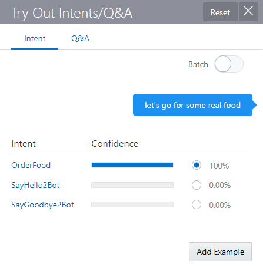

13. 오른쪽 상단에 `[X]` 을 선택하여 테스트를 종료 합니다.

14. 왼쪽 상단 툴바에서 있는 엔티티(Entities) 아이콘을 선택합니다.(위에서 2번째 위치해 있음) 

15. `[More]` 버튼을 선택하고  and `[Import 'Value list' entities]` 를 선택합니다.

16. 앞서 다운로드 받은 **OrderFoodEntities.csv** 와 **YesNoEntity.csv** 파일을 Import 합니다.

17. 직접 새로운 엔티티를 생성하고 위해서 **``[+ Entity Button]``** 선택합니다.  새로운 엔티티 이름은 **“FullMenu”** 입니다.

- Configuration의 Type 항목에서 **“Entity List”** 옵션을 선택하고 아래와 같이  엔티티 리스트를 추가 합니다.

- "**Lunch**" 와 "**Snack**" 를 하위 엔티티로 추가 합니다. "**Food Temp**" 와 같은 다른 엔티티는 삭제합니다.

18. intent 탭으로 돌아가서, **"OrderFood"** intent를 선택하고, 오른쪽 상단에 있는 ``[+Entity]`` 버튼을 선택합니다. (intent tab 은 좌측 상단 툴바에 첫번째 아이콘 입니다.)

19. 스크롤 다운을 하면 아래 엔티티 리스트를 할 수 있고, 엔티티의 정의를 선택하고 현재 intent 에 추가 합니다. 

  - FoodTemp 
  - Lunch
  - Snack
  - FullMenu
  - MenuType  

해당 설정을 통해서 인텐트와 관련있는 의미 있는 엔티티가 무엇인지 NLP 엔진이 쉽게 구분해 낼 수 있습니다.

20. **`[Try Out]`** 버튼을 선택하여 테스트를 재시작 합니다. (이전 테스트 기록을 계속해서 보고 싶다면, Restart 를 선택합니다) 

21. 아래와 같이 메시지를 입력하여, 해당 인텐트의 엔티티를 정상적으로 식별하는지 확인합니다.

eg. **"I'd like a nice hot beef pie for lunch"**

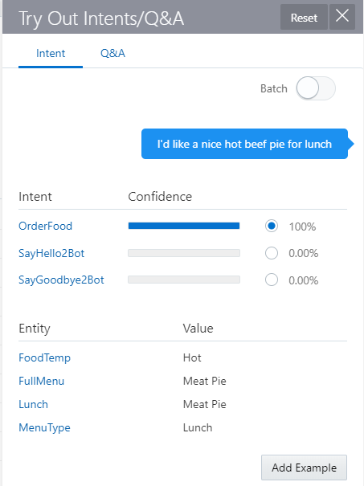

- Close the tester for the time being.

22. 메모장을 통해서 앞서 다운로드 받은 `DialogYAML.zip` 파일에 안에 DialogYAML 디렉토리에 있는 **OrderFoodDialog.txt** 파을 열고, 모든 텍스트 내용을 복사합니다.

23. 왼쪽 메뉴에서 다이얼 로그 플로우 메뉴를 선택합니다. (아래 아이콘)

24. 디폴트로 입력되어 있는 코드를 삭제 하고, 아래와 같이 이전에 다운로드 받은 컨텐츠를 붙혀 넣기를 합니다. (**``OrderFoodDialog.txt``** )

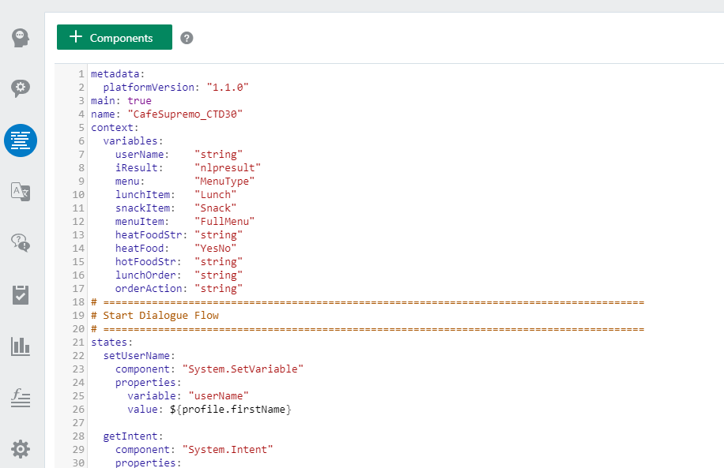

25. 우측 상단에 **`[Validation]`** 버튼을 클릭하여 확인하세요. 정상적인 경우 아래와 같이 메시지가 표시됩니다.

26. 아래와 스킬 테스트 버튼을 선택하여, 스킬을 테스트 하세요.

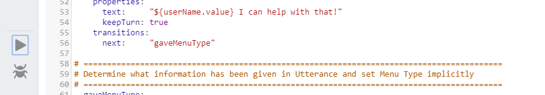

Validate 과정에서 문제가 발생한 경우, 아래 버그 버튼을 선택하여 어디서 오류가 발생하였는지 알수 있습니다.

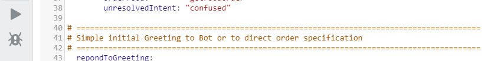

27. Bot의 대화 흐름을 확인 할 수 있는 다양한 표현들을 입력해 보세요 .

- I’m really Hungry
- I’d like something for Lunch
- Can I have a chicken wrap
- I’d like a bite to eat
- Could really go for some real food
- Can I have a slice of Banana Bread with my coffee please?

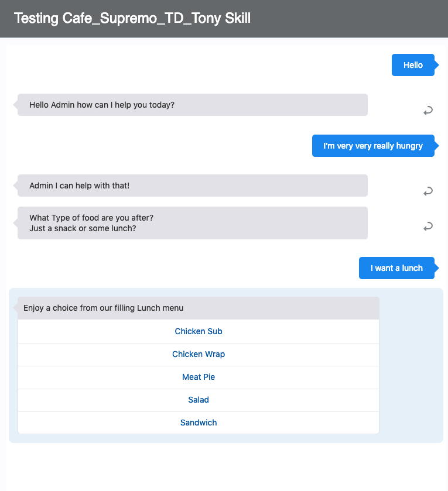

# Lab 2 끝 #

In [실습 3](300-IB.md), 에서는 조직의 Bot of Access 데이터를 구성하는 방법 다룹니다.

<< [홈으로 이동](../README-ODA.md)
