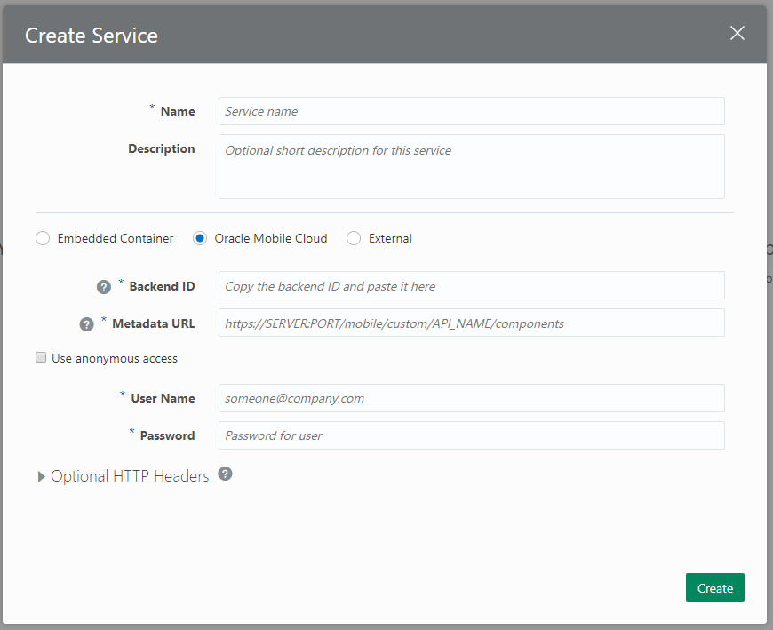
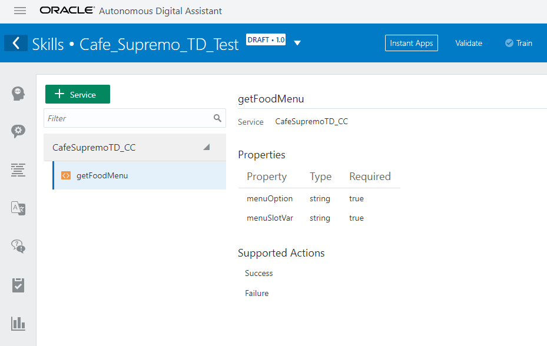
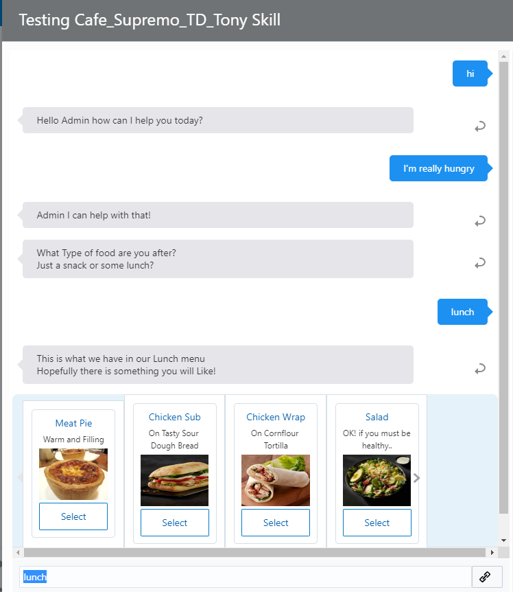

# 오라클 클라우드 테스트 드라이브 #

## Lab 3: 커스텀 컴포넌트 ## 
<< [커스텀 컴포넌트 소개 페이지로 돌아가기](300-IB.md)


### 스킬에 커스텀 컴포넌트 등록 하기 ###

이번 세션에서는 이미 Oracle Mobile Hub 에 만들어져 있는 커스텀 컴포넌트 서비스를 스킬 에 추가하는 과정을 실습하겠습니다.

1. 스킬 디자이너를 오픈 합니다. 이전에 디자인 했던 실습자의 본인의 스킬을 오픈 합니다.
2. 컴포넌트 서비스 아이콘을 선택하며, 해당 페이지로 이동합니다. (아이콘 이미지 참고)


Click the **`[+ Service ]`** 버튼을 선택하여 스킬에 새로운 커스텀 컴포넌트를 등록 합니다. 


3. 아래 정보를 참고하여 커스텀 컴포넌트 입력란을 작성합니다.



<table width="50%" border="0">
  <tr>
    <td>Name:</td>
    <td>CafeSupremoTD_CC</td>
  </tr>
    <tr>
    <td>Description:</td>
    <td>A Custom Component to retrieve menu Information from the Backend.</td>
  </tr>
  <tr><td colspan=2></td></tr>
  <tr>
    <td colspan=2>( )Embedded Container (*) Oracle Mobile Cloud ( ) Other</td>
  </tr>
  <tr>
    <td>Backend ID:</td>
    <td>
    Oracle Mobile Hub 에서 노출한 커스텀 컴포넌트 API 의 백앤드 ID
    <br/><br/>
    eg.<br/>
    <code>
      <strong>84a94fd1-afc5-483d-aa35-64739be4a862</strong>
    </code>
    <br/><br/>
    <strong>Note</strong>: 변경된 경우 현재 호스트 기본 URL은 운영자가 제공합니다.</td>
  </tr>
  <tr>
    <td>MetaData URL:</td>
    <td>
      The <code>/get</code> method for the Custom Component
    <br/><br/>
    eg.<br/>
    <code>
     <strong>https://6BB990B7A9C44F2CADF86A635CCED5F1.mobile.ocp.oraclecloud.com:443/mobile/custom/CafeSupremoTD/components<strong>
    </code>
    <br/><br/>
    <strong>Note</strong>: 변경된 경우 현재 호스트 기본 URL은 운영자가 제공합니다.</td>
  </tr>
  <tr><td colspan=2></td></tr>
  <tr>
  <td colspan=2><code>[*]</code> Use anonymous access</td>
  </tr>
  <tr>
    <td>Anonymous Key:</td>
    <td>
    모바일 백엔드의 익명 키 값
    <br/><br/>
    eg.<br/>
    <code>
    <strong>NkJCOTkwQjdBOUM0NEYyQ0FERjg2QTYzNUNDRUQ1RjFfTW9iaWxlQW5vbnltb3VzX0FQUElEOmE5ZjM2MDJmLWJjNDgtNGY3My05NWNlLTkxYzI2NDdjZThmMg==</strong>
    </code>
    <br/><br/>  
    <strong>Note</strong>: 현재 버전은 운영자가 제공합니다.
    </td>
  </tr>
</table>

**NOTE:** **``Oracle Mobile Cloud``** 와 **``Use Anonymous Access``** 옵션을 선택하세요.

**``[Create]``** 버튼을 선택하면, 컴포넌트 서비스가 등록됩니다.

4. 커스텀 컴포넌트가 등록이되면, Dialog Flow 에서 사용가능 한 상태로 표시 됩니다.

``getFoodMenu`` 항목을 선택하면 컴포넌트의 실행 결과에 결과와 필요한 파라매터들이조회됩니다.



5. Dialog Flow 아이콘을 선택하여 Dialog Tab 으로 이동합니다.


작성된 Dialog Flow 에서 아랫 부분에서 다음과 같은 내용을 찾습니다.

```yaml
# #########################################################################################
# TEST DRIVE LAB 3: Custom Component
#
# Dynamically show the Appropriate Menu, based on the selected food requirement.  
# This one component replaces the original (multiple) hard coded menu states below. 
# #########################################################################################
 
#  showMenu:
#    component: "getFoodMenu"
#    properties: 
#      menuSlotVar: "menuItem"
#      menuOption: ${menu.value}
#    transitions:
#      actions:
#        Success: "getFoodHeatedOption"

#        Success: "wasSandwichChosen"
# (Replace success Action in Lab 4 => "wasSandwichChosen")
# #########################################################################################

```
방금 등록된 커스텀 컴포넌트는 온라인 메뉴 시스템으부터 동적으로 데이터를 반환하며, 이를 통해  메뉴를 소개 하기 위한 UI 를 추가로 만들 필요가 없습니다.

6. **``showMenu``** 에서 **``Success``**을 **``"#"``** 를 제거 하세요.  

<table width="75%" border="0">
  <tr>
    <td>
    <pre>
#  showMenu:
#    component: "getFoodMenu"
#    properties: 
#      menuSlotVar: "menuItem"
#      menuOption: ${menu.value}
#    transitions:
#      actions:
#        Success: "getFoodHeatedOption"
    </pre>
    </td>
    <td width="20%"><strong>Converted to =></strong></td>
    <td>
    <pre>
showMenu:
  component: "getFoodMenu"
  properties: 
    menuSlotVar: "menuItem"
    menuOption: ${menu.value}
  transitions:
    actions:
      Success: "getFoodHeatedOption"
    </pre>
    </td>
  </tr>
</table>

7. 스킬 테스터를 다시 실행하여, 커스텀 컴포넌트가 어떻게 변화를 주는지 확인 하세요. 이 경우 커스텀 컴포넌트는 Oracle 스킬 일반 메시지 모델을 기반으로 UI를 생성하며, 다중 채널을 통해 실행되는 사용자와 복잡한 메시지 교환을 개발할 수 있습니다 (단, 채널의 모양과 느낌을 그대로 유지).



In [Lab 4](400-IB.md), 다음으는 스킬과  "**Instant App**" 을 사용할 수 있도로 하기 위한 Wizard 에 대해 배우게 됩니다.


## 실습 끝 ##


# Lab Exercise: #
<< [커스텀 컴포넌트 소개 페이지로 돌아가기](300-IB.md)
