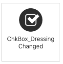

# 오라클 테스트 드라이브 #

## Lab 4 인스턴트 앱(Instant App) 활용 ##

### 소개 ###

 챗봇과 대화하는 인터페이스는 백엔드 프로세스 또는 데이터와 자연스러운 상호 작용이 가능 하지만, 많은 데이터를 주고 받아야 하는 대화의 경우 오히려 질문과 응답하는 형태의 대화가 더 어렵고 번거러울 수 있습니다. 각각의 사용자의 많은 질문의 대한 데이터를 제공하기 위해 반복적인 질문을 사용자에게 요구하고 그에 대한 응답 제공하기 보다는, 이미 우리에게 익숙해 있는 입력 폼 형태의 인터페이스를 사용하면, 여러번의 질문과 응답 보다 한 번에 데이터를 입력하는 것이 더 효율적이고 직관적일 수 있습니다.

 이러한 요구사항을 위해 Oracle Digital Assistant에서는 `인스턴트 앱(Instant App)` 을 사용하여 해결 할 수 있습니다. `인스턴드 앱(Instant App)` 은 봇과 사용자와의 대화에서 조금 더 구체적이고 많은 질의가 필요한 시점에 대화의 흐름과 통합될 수 있는 될 수 있는 위젯(Widget) 입니다. `인스턴트 앱(Instant App)` 을 대화 흐름에 통합하고 표준 UI 요소 (텍스트 필드, 리스트, 라디오 버튼, 체크 박스 등)를 사용하는 입력 폼(Form) 인터페이스를 사용하여 사용자로 부터 구조화 된 데이터를 쉽게 수집 할 수 있습니다. 또한 사용자의 입력에 대해 모든 유효성 검사 가능하며, 입력된 정보를 다시 대화 단계로 다시 전달 할 수 있습니다. 

 결국, **`인스턴트 앱(Instant App)`** 을 이용하면 대화형 인터페이스에서 발생 할 수 있는 번거로운 대화의 한계를 극복할 수 있습니다.

 이번 세션 에서는 :
  - 기존에 일부 만들어진 인스턴트 앱을 사용하여, 인스턴트 앱 빌더와 그 안에서 사용할 수 있는 화면 디자인 기능에 대해 알아 보도록 하겠습니다.
 
<table width="50%" border="0">
  <tr>
    <td align="Left">
    <ul><li><B>점심 메뉴 디자인:</B></li></ul><br>
    만약 고객이 샌드 위치를 메뉴를 선택 한 경우 고객이 원하는 샌드 위치 옵션을 결정 할 수 있는 단순한 폼입니다.
    <BR>
    </td>
    <td align="Center"></td>
  </tr>
</table>

  **NOTE**: 인스턴트 앱을 봇과의 대화 흐름과 통합하기 위해서는 **_System.Interactive_** 컴포넌트를 Dialogue Flow 에서 사용합니다. 해당 컴포넌트는 대화 흐름에서 필요한 정보를 인스턴트 앱으로 전달하고(이번 케이스에서는 사용자의 이름을 전달함) 하고 인스턴트 앱에서 사용자의 입력이 완료 되면 다시 대화 흐름에 전달 하게 됩니다. (32 단계 참고)
    
### 실습 ###

  1. 강사가 알려준 Oracle Digital Assistant 에 접속 합니다.

    http://{hostname:port}/botsui/bot

  2. 상단 우측에 **`[Instant App]`** 버튼을 클릭하여 인스턴트 앱 빌더를 오픈 합니다.

  

  

  3. 인스턴트 앱 빌더는 인스턴트 앱을 개발을 시작하기 위한 다음 방법을 제공합니다.

  - 완전히 비어있는 화면에서 처음 부터 시작 하는 방법
  - 사용 목적에 따라 이미 디자인된 템플릿을 활용
  - 기존에 만들어진 Instant App(Json 파일)로 부터 임포트
  - 이전에 만들어진 Instant App 을 복사하여 사용

  인스턴트 앱을 생성하는 화면으로 이동하기 위해 **`[Add Instant App]`** 버튼을 클릭합니다.

  

  위와 같이 새로운 인스턴트 앱을 만들기 위한 다양한 옵션을 볼 수 있습니다.
  위 옵션에서 **`[Use a Template]`** 을 선택합니다.

  

  4. 이번 실습에서는 이미 일부 만들어진 인스턴트 앱을 복사하여 시작 하도록 하겠습니다. 다시 메인 페이지로 돌아 가기 위해서 우측 상단에 "Cancel" 버튼을 선택 합니다.

  

  5. 스크롤을 내려서 이미 만들어진 "CafeSupremo : Design My Lunch" 인스턴트 앱을 선택 합니다. 아래 이미지를 참고하세요.

  

  **NOTE**: 만약 현재 실습 환경에 위 인스턴트 앱이 없는 경우, [here](Provisioning/CafeSupremo_DesignMyLunch.json) 에서 다운로드 받으세요. 그리고 Oracle Instant App Builder 에서 **`Add Instant APP`** 을 선택하고 **`import`** 를 선택하여, 다운로드 받은 파일을 import 하세요.

  6. 인스턴트 앱을 선택하면 아래 이미지와 같이 메뉴가 출력되고 **`Edit a Copy`** 를 선택 합니다. 

  

  이 후 아래와 같이  복제된 인스턴트 앱이 생성됩니다.

  

  7. 인스턴트 앱 이름을 “Copy of CafeSupremo : Design My Lunch” 에서 “CafeSupremo : Design My Lunch [Your Initials]” 으로 변경합니다.

  

  **`중요`** : 위 이미지에서 APP ID 를 기억 하거나 기록해 두도록 합니다. 해당 APP ID 는 Skill의 Dialogue Flow 와 Instant App을 통합 할때 필요합니다. (31단계 참고)

  8. 현재 패널의 레이아웃 및 UI 구성 요소를 보기 위해서 "“MySandwichOptions”"을 선택합니다. 

  

  9. 샌드위치에 Dressing 을 선택 할 수 있도록 Checkbox 를 추가 하도록 하겠습니다. Checkbox 를 선택하고 빌더의 왼쪽 패넬의 "MySandwichOptions"의 "Chkbox_Salad" 구성요소 하단으로 아래와 같이 Drag 합니다.

  

  10. 추가한 Checkbox에 아래와 같이 설정 정보를 입력합니다.

  <table width="50%" border="0">
    <tr>
      <th>Property</th>
      <th>Value</th>
    </tr>
    <tr>
      <td>Element ID</td>
      <td>ChkBox_Dressing</td>
    </tr>
    <tr>
      <td>Label</td>
      <td>Dressing</td>
    </tr>
  </table>

  11. Checkbox 의 스타일을 변경합니다. 상단에 있는 **`Style`** 버튼을 클릭 합니다.

  

  12.	추가한 CheckBox 의 너비를 조절하기 위해서 Layout 영역을 펼칩니다. (기본으로 사이즈는 패널의 100% 사이즈로 지정되어 있습니다.)

  

  -  위와 같이 25% 사이즈로 조정 합니다.

  **`NOTE`**: 25%로 사이즈를 조정해야만 새로 만든 CheckBox 가 다른 옵션들과 함께 한줄에 들어 갈 수 있습니다.

  13.	다시 구성되어 있는 Element를 보기 위해서 좌측 패널의 "MySandwichOptions" 를 선택합니다. 

  14.	다음으로는 Salad 를 추가 할 수 있는 옵션을 추가해 보도록 하겠습니다. 아래 이미지와 같이 Radio 버튼를 선택하여 MySandwichOptions 에 있는 "Choose_Salad_Options" Radio Option 하단으로 드래그 합니다.


15.	MySandWichOption 에 새로 추가한 Radio button 을 클릭하여, 세부 속성 정보 표시 됩니다.

16.	아래와 같이 Radio 버튼의 속성을 설정합니다.

<table width="50%" border="0">
  <tr>
    <th>Property</th> 
    <th>Value</th>
  </tr>
  <tr>
    <td>Element ID</td>
    <td>Choose_Dressing_Type</td>
  </tr>
  <tr>
    <td>Label</td>
    <td>Choose Your Sauce...</td>
  </tr>
    <tr>
    <td>Initially Visible</td>
    <td>UNCHECKED</td>
  </tr>
    <tr>
    <td>Display Items Inline</td>
    <td>CHECKED</td>
  </tr>
</table>

17.	"Add Radio Button" 을 클릭하여 새로운 Radio 버튼 그룹을 "Choose_Dressing_Type 으로 추가합니다.


18. 추가 한 Radio 버튼의 Label 을 설정 합니다.

<table width="50%" border="0">
  <tr>
    <th>Radio Button</th>
    <th>Label</th>
    <th>Value</th>
  </tr>
  <tr>
    <td align="center">1</td>
    <td>Mayo</td>
    <td>MAYO</td>
  </tr>
  <tr>
    <td align="center">2</td>
    <td>Honey Mustard</td>
    <td>HONEY_MUSTARD</td>
  </tr>
    <tr>
    <td align="center">3</td>
    <td>BBQ Sauce</td>
    <td>BBQ</td>
  </tr>
</table>

19. 새로 추가 한 "Choose_Dressing_Type" 옵션의 경우 사용자가 Dressing CheckBox 를 선택한 경우 화면에 나타나야 합니다. (선택되지 않은 경우에는 사라져야 함)

- 애플리케이션 또는 Element 에 정의된 다양한 Event 들을 보기 위해서는 "Event and Action" 버튼을 클릭합니다. (애플리케이션에 추가되어 있는 Element 들을 기반에 대해서)


NOTE: 녹색 점은 어디에 Event 조건 또는 액션이 적용되어 있는지 표시 합니다.

20. Event 를 지정해야 하는 ChkBox_Dressing Element 를 선택 합니다. (ChkBox_Dressing Change 이벤트가 발생 따라 동작해야 함)



21. 아래와 같이 이벤트 조건 리스트에서  "value changes to true" 를 선택 합니다.


22. 위와 같이 이벤트 조건에 해당 하는 경우 수행 해야 하는 액션을 정의 합니다. 아래와 같이 이벤트가 발생 했을 때 실행되어야 하는 `Add Action` 링크를 선택합니다. 


 - "**Make Elements Visible**" 를 선택하고, 이벤트 발생 시 영향을 받는 Element 를 선택 합니다.
 


23. 아래 이미지를 참고 하여, "**Choose_Dressing_Type**" 을 Drag 하여 "Action: Make Elements Visible" 에 위치 시킵니다. 


 - 다른 이벤트를 처리 하기 위해서 `+ Add Condition` 링크를 클릭 합니다.
 
 - 조건 리스트에서 "“ when value changes to false” 를 선택 합니다.
 
 - "Make Element Invisible" 과 "Reset Elements" 2개의 Action을 추가 하고, 조건에 추가 합니다.

 - 위 2개의 Action 에 "Choose_Dressing_Type" Radio Button 을 위치 시킵니다.
 


24.	"Events and Actions" 메뉴를 선택하거나, Event 설정 페이지에서 [Back] 버튼을 선택하여, "Event and Actoins" 페이지로 돌아 갑니다.

25.	이벤트, 조건, 액션을 추가 하기 위해 “Submit_Button_Pressed” 버튼을 클릭 합니다. 해당 이벤트는 입력이 완료되었을 때 발생 하는 Event 입니다.


 - 버튼이 눌렸을 때 실행되어야 하는 구체적인 설정을 하기 위해서 `+ Add Condition` 링크를 선택 합니다.
 

 
 - 리스트에서 `[button is pressed regardless of validation]` 옵션을 선택 합니다.
 

  
 - 버튼을 클릭 되었을 때 Action 을 추가 하기 위해서  `+Add Action` Link 를 선택 합니다.
 
 - "**Exit to Bot**" 을 선택하여 Action 을 추가 합니다. 해당 Action 은 다시 대화로 돌아가기 위한 Action 입니다.
  

 
26.	 `+Add Action` 을 다시 추가하여 동시 실행 되어야 하는 Action 을 추가합니다.

 - “**Activate and Show Pane**” 을 버튼 Action 에 추가 합니다.
 


 - 아래와 같이 "Choices_Made_Pane" Action 을 드래그 하여 위치 시킵니다.
 
 
 
 NOTE: 이 패널은 주문된 정보에 대해서 간단하게 확인하는 페이지로 사용됩니다.
 
27.	Bot과의 대화로 다시 전달해야 하는 정보에 대해서 정의해야 합니다.  25 스텝에서 생성된 "Exit to Bot" Action 에서 파라매터가 추가되어 정의 합니다.

 - `+ Add Parameter` 선택하여 Action 에 전달할 6개의 파라매터를 추가 합니다.
 
  
  
 - 추가하는 파라매터는 아래와 같습니다.
 
 <table width="50%" border="0">
  <tr>
    <th>Parameter Name</th>
    <th>Parameter Value</th>
  </tr>
  <tr>
    <td>ORDER_ACTION</td>
    <td>SUCCESS</td>
  </tr>
  <tr>
    <td>SANDWICH_TYPE</td>
    <td>{ChooseLunchType}</td>
  </tr>
  <tr>
    <td>CHEESE</td>
    <td>{Choose_Cheese_Type}</td>
  </tr> 
    <tr>
    <td>MEAT</td>
    <td>{Choose_Meat_Type}</td>
  </tr> 
    <tr>
    <td>SALAD</td>
    <td>{Choose_Salad_Options}</td>
  </tr> 
    <tr>
    <td>DRESSING</td>
    <td>{Choose_Dressing_Type}</td>
  </tr> 
</table>
 
 NOTE: 위 에서 { } 의 사용은 사용자가 입력 한 값을 참조 하는데 사용됩니다.

28.	Instant App 저장을 선택하고, Bot Build 로 되돌아 갑니다.

29. 만액 Skill Builder 오픈되어 있지 않은 경우에 이전에 만든  “**Café_Supremo_TD_[YOUR INITIALS]**”  Skill 을 오픈 합니다.

30.	왼쪽 툴바 에서 3번째에 위치하고 있는 Dialog Flow 아이콘을 선택하여 BotML Text Editor 를 오픈 합니다.

  
  
31.	스크롤 다운하여 Sandwich 고르는 대화 단계를 찾습니다.

 NOTE: **"wasSandwichChoen"** 스텝에서는 "System.ConditionEquals"을 사용하여 사용자가 샌드위치를 선택했는지 안했는지에 따라 다음 스텝이 분기가 되도록 되어 있습니다. 현재는 아래와 같이 주석처리로 인해 샌드위치가 아닌 경우로만 대화가 진행이 되도록 되어 있습니다.  **"designYourLunch"** 의 경우  **_System.Interactive_** 으로 정의 되어 있습니다. 

```yaml
  wasSandwichChosen:
    component: "System.ConditionEquals"
    properties:
      variable: "menuItem"
      value:    "Sandwich"
    transitions:
      actions:
#        equal:    "designYourLunch"
        notequal: "getFoodHeatedOption"

# #########################################################################################
# TEST DRIVE LAB 4 : Instant Apps for Structured ContentCustom Component 
#
# Add a Sandwich design Wizard to the conversation allowing user to specify their Sandwich
# Content.
#
# The input and subsequent Output from the Sandwich Wizard are defined in the properties
# of the system.interactive Component.
# 
# Properties
# sourceVariables : information being passed to the Instant App (in this case the userName)
# variable        : payload coming back from Instant App is copied to this variable
# ID              : The id of the Instant App to be called from the Bot.
# #########################################################################################
        
#  designYourLunch:
#    component: "System.Interactive"
#    properties:
#      sourceVariableList: userName
#      variable: lunchOrder
#      id: [ID OF YOUR INSTANT APP]  
#      prompt: "Please click on the Link below to go to the Sandwich design wizard" 

# ######################################################################################### 
```
**Note:** 
  - "sourceVariables" 의 경우 Instant App 으로 전달해야 하는 경우에 사용되는 사용되는 속성 입니다.
  - “variable” 속성은 instant App 에서 다시 돌아올때 참조되는 변수에 해당 합니다.
  
  
  - ID 항목은 instant App 을 만들때 사용된 App ID 를 입력합니다.
    예) CafeSupremo__Design_My_Lunch_YOUR_INITIALS

  - designYourLunch 에서 주석 처리를 위해서 사용된 # 을 시작에서 끝가지 모두 제거 합니다. 아래와 같이 동일하게 # 을 제거하시면 됩니다.
 
**`주석 제거 전`**
```yaml
#  designYourLunch:
#    component: "System.Interactive"
#    properties:
#      sourceVariableList: userName
#      variable: lunchOrder
#      id: [ID OF YOUR INSTANT APP]  
#      prompt: "Please click on the Link below to go to the Sandwich design wizard" 
```
**`주석 제거 후`**

```yaml
  designYourLunch:
    component: "System.Interactive"
    properties:
      sourceVariableList: userName
      variable: lunchOrder
      id:  CafeSupremo__Design_My_Lunch_YOUR_INITIALS  
      prompt: "Please click on the Link below to go to the Sandwich design wizard" 
```
 - wasSandwichChosen 에서 **"equal"** 조건에 충족하는 경우, 즉 사용자가 `"Sandwich"` 라는 단어를 입력한 경우에 designYourLunch 로 대화 흐름이 이동 할 수 있도록 아래와 같이 # 을 제거합니다.

**`주석 제거 전`**

```yaml    
  wasSandwichChosen:
    component: "System.ConditionEquals"
    properties:
      variable: "menuItem"
      value:    "Sandwich"
    transitions:
      actions:
#        equal:    "designYourLunch"
        notequal: "getFoodHeatedOption"
```
**`주석 제거 후`**

```yaml
  wasSandwichChosen:
    component: "System.ConditionEquals"
    properties:
      variable: "menuItem"
      value:    "Sandwich"
    transitions:
      actions:
        equal:    "designYourLunch"
        notequal: "getFoodHeatedOption"
```
 32. **showMenu** 대화 단계에서 "success" 인 경우에, "**getFoodHeatedOption**" 대신에 “**wasSandwichChosen**" 으로 이동 하도록 변경 합니다.

 이 변경은 대화 흐름을 사용자가 Sandwich 를 선택했는지 안했는지 대해서 테스트 하려고 합니다. 만약 Sandwich 를 선택 한 경우, "designYourLunch" instant App 으로 흐름이 변경됩니다. 
 
 ```yaml
   showMenu:
    component: "getFoodMenu"
    properties: 
      menuSlotVar: "menuItem"
      menuOption:  ${menu.value}
    transitions:
      actions:
        Success: "getFoodHeatedOption"
```
**`getFoodHeatedOption 으로 진행되는 대화 흐름을 wasSandwichChosen 으로 변경하`**

```yaml
  showMenu:
    component: "getFoodMenu"
    properties: 
      menuSlotVar: "menuItem"
      menuOption:  ${menu.value}
    transitions:
      actions:
        Success: "wasSandwichChosen"
```
33. 왼쪽 하단에 있는 "Play" 아이콘을 클릭하여 Skill 을 테스트 합니다.
33.	Run the Bot in the Test environment (within The Bot Builder) by clicking the “Play” icon in the tight corner.

 

 -“I want some lunch” 라고 표현을 입력 합니다.
 
 
 
 - “**Sandwich**” 을 선택 합니다. “**Sandwich**” 를 선택하게 되면 "**Sandwich Design Wizard**" Instant App 을 통해 Sandwich 의 내용을 선택 할 수 있게 됩니다.
 
  
 
 - 링크를 선택하여 앞에서 생성한 "Instant App"을 실행 하도록 합니다.

   NOTE: 현재 웹 브라우저를 사용하고 있는 것고 동일하게 instant App 브라우저 탭이 실행됩니다.

 
 
 - 원하는 **Sandwich** 를 리스트에서 선택합니다.
 - 화면 입력 폼에서 원하는 옵션을 추가로 선택 합니다.
 
 
  
 - 원한 옵션을 선택을 모두 다 하고 나서 **``[Go Make it please!]``** 버튼을 클릭 합니다.
 
 
 
 - 선택한 옵션을 확인 하기 위한 화면을 보고, 브라우저 탭에 [X] 를 클릭합니다. 그리도 다시 이전에 Skill 테스트 화면으로 되돌아 옵니다.

   NOTE: 선택된 샌드위치 옵션이 현재 대화 흐름에 내용에 통합됩니다. 
   
 
   
 - 샌드위치를 따듯하게 할 것인지 아닌지 선택을 합니다. 

 - Say goodbye 를 입력하여 대화를 종료 합니다.

 ## 오늘 랩의 결과 ##

이번 랩 에서는 : 
   - 대화 흐름 속에서  instant App 을 통해 많은 양의 데이터를 쉽게 대화와 통합 할 수 있는지 보았습니다.
   - Intant App 을 Instant App Builder 를 통해 확장
   - 대화와 통합된 입력 양식에서 두번의 데이터 교환 - Skill 에서 입력 폼으로, 입력폼에서 Skill 로
 
 In [Lab 5](500-IB.md) & [Lab 6](600-IB.md) Oracle Digital Assistant 는 웹 페이지에 노출:
 - [웹 사이트에 노출](500-IB.md)
 - [A Social Channel - Facebook Messenger](600-IB.md)

## 실습 끝 ##

# Lab Exercise: #

<< [Digital Assistant Home 으로 이동](../README-ODA.md)

